# Principia

**A graph-native knowledge system where every new concept builds on what is already known.**

<p align="center">
  
</p>

Principia turns technical understanding into a reusable dependency graph. Each concept is a small,
versioned Markdown node; each edge names a prerequisite. When you ask Principia to learn something
new, its agent reuses concepts already present and creates only the missing knowledge.

> **Closed-world grounding:** every concept must resolve through declared prerequisites already in
> the graph, recursively reaching explicit axioms. No unexplained dependency is hidden in prose.

## Why Principia

- **Knowledge compounds.** A concept learned once becomes a foundation for future explanations.
- **Explanations stay grounded.** Every `[[wikilink]]` is checked against an explicit prerequisite.
- **Everything remains inspectable.** Knowledge is plain Markdown, versioned and reviewed with Git.
- **Automation is auditable.** The agent makes semantic decisions; deterministic Python validates,
  diffs, catalogs, and renders them.
- **The result is portable.** No database or server is required, and the dashboard works offline.

## How Knowledge Grows

1. **Ground** — connect a new concept to knowledge already in the graph.
2. **Learn** — author and validate the missing node and its explanation.
3. **Advance** — reuse the expanded graph as the foundation for the next request.
4. **Repeat** — the graph grows without duplicating shared prerequisites.

The bundled `/install-concept` skill orchestrates this workflow. `brain.py` is the deterministic
engine: it records the agent's decisions and enforces graph invariants, but never invents knowledge.

## Quick Start

Principia requires Python 3, [`uv`](https://docs.astral.sh/uv/), Git, and a browser. From the
repository root:

```bash
uv run principia audit
uv run principia tree onnx-runtime
uv run principia graph
```

Open `web/graph.html` directly to explore the self-contained dashboard.

For a private local reading view with searchable nodes, full Markdown pages, notes, and progress
statuses, run:

```bash
uv run principia-app --port 8876
```

Then open <http://127.0.0.1:8876>. Reading state is stored separately from the graph in
`~/.local/share/principia/status.sqlite3`; set `PRINCIPIA_STATUS_DB` to use another path. The local
app also links to the unchanged self-contained dashboard as its **Open static mirror** view.

Principia discovers the nearest `principia.toml` automatically; use
`uv run principia --workspace /path/to/graph audit` to target another graph.

To add knowledge with the bundled Claude Code workflow:

```text
/install-concept <new-concept>
```

Start with the [getting-started guide](docs/getting-started.md) for the full first-use workflow.

## Repository Map

| Path | Role |
|---|---|
| `nodes/` | Source of truth: concepts, optional translations, and figures |
| `brain.py` | Standard-library graph engine behind the `principia` command |
| `principia.toml` | Workspace paths for nodes and generated outputs |
| `docs/` | Product, architecture, data-model, and CLI documentation |
| `protocols/` | Canonical authoring and visual rules |
| `.claude/skills/` | Agent workflows for installing, settling, and illustrating concepts |
| `specs/` | Persistent figure-design specifications |
| `web/` | Dashboard template, renderer, generated page, and product visuals |
| `MANIFEST.md` | Generated graph catalog |

`MANIFEST.md` and `web/graph.html` are derived outputs. Regenerate them instead of editing them by
hand.

## Documentation

| Guide | Use it for |
|---|---|
| [Documentation index](docs/README.md) | Find the canonical guide for a task |
| [Getting started](docs/getting-started.md) | Run, inspect, extend, and render Principia |
| [Architecture](docs/architecture.md) | Understand the graph, layers, lifecycle, and generated views |
| [Node model](docs/node-model.md) | Author frontmatter, links, summaries, types, and taxonomy |
| [CLI reference](docs/cli-reference.md) | Use every `principia` command safely |
| [Repository guidelines](AGENTS.md) | Contribute and verify changes |

Authoring policy lives in [`protocols/EXPLAIN.md`](protocols/EXPLAIN.md); visual policy lives in
[`protocols/VISUAL_PROTOCOLS.md`](protocols/VISUAL_PROTOCOLS.md).
