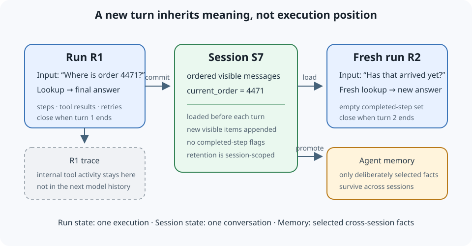

# Agent Session State

## Summary

**Agent session state** is the conversation-scoped record that connects several independent agent runs into one interaction. It preserves the user-visible history and domain facts needed by the next turn, but it does not preserve the previous run's completed-step flags, cached intermediate outputs, or active control flow. Those belong to the finished run. Information intended to survive across conversations belongs in [[agent-memory]] instead.

## Grounded explanation

### Three lifecycles, not one state object

A multi-turn agent has three different time boundaries:

1. **Run state** exists for one execution. It includes the current input, which steps have completed, intermediate tool results, retry counters, and a final output. It ends when that run completes or is abandoned.
2. **Session state** exists for one conversation. A session identifier selects an ordered history of user-visible messages plus conversation-scoped domain data, such as the order number discussed earlier. It survives from one turn to the next but ends under an explicit retention or expiration policy.
3. **Cross-session memory** contains selected facts meant to remain useful after this conversation ends. That longer-lived function is [[agent-memory]], not an automatic copy of the session transcript.

Combining these records creates stale-state bugs. If completed-step flags survive into the next turn, a graph runner can decide that work is already finished and replay an old result. If every trace or tool result is copied into the conversation, later model calls pay to reread implementation detail that the user never saw. If the complete conversation is promoted to long-term memory, private or temporary context can outlive its intended scope.

### The turn boundary is the invariant

For each new message, the runtime should perform this sequence:

1. resolve the session identifier and load the session's ordered conversation state;
2. create a **fresh** run record with no completed steps or cached outputs from the prior turn;
3. combine the permitted session history with the new input under a bounded context policy;
4. execute routing, model calls, and tools while recording intermediate activity outside the visible history;
5. append only the new conversational items and selected domain-state updates to the session;
6. close the run and its [[trace-span]], leaving no live execution progress for the next turn.

The invariant is: **a later turn may inherit conversation meaning, but it must not inherit the earlier turn's execution position.** A paused run is different from a new turn: resuming an interruption intentionally restores the same run record and approval state, while a new message starts a new run against the same session.

Session storage must also preserve ordering. Two messages for the same session can arrive concurrently; without a sequence number, version check, [[transaction]], or per-session serialization rule, both runs may read the same old history and overwrite one another's updates. The correct mechanism depends on the storage system, but the required outcome is the same: the committed session history has one unambiguous order.

### Tool calls make crash recovery a reconciliation problem

A tool-using turn has an additional structural invariant: the persisted assistant tool call and the tool result returned to the model must remain paired by the call identifier. Official tool-use protocols represent that round trip explicitly: the model emits a structured call, the application executes it, and a later message returns a result referring to the same identifier. Persisting only the call can therefore leave a history that cannot continue correctly after a crash.

The local session commit and an external side effect usually cannot be one atomic [[transaction]]. A process may die after a refund succeeded but before its result was recorded. Recovery must classify the call as **outcome unknown**, consult an execution receipt or the external system, and only then record the result or retry. Deleting the call loses audit history; blindly retrying can repeat a consequential action. For a repeatable operation, the application should send a stable idempotency key and persist states such as `planned`, `started`, `succeeded`, `failed`, and `unknown` so replay converges on one outcome.

The commit boundary is therefore not merely “append the assistant message.” It is “commit a history prefix that the next model request can interpret, plus enough execution metadata to reconcile every in-flight call.” A synthetic interruption result may make the protocol history structurally complete, but it must say that the outcome is unknown rather than claiming the tool failed.

### Worked instance

Consider a support agent receiving two messages under session `S7`.

**Turn 1 input:** “Where is order 4471?” The runtime loads an empty session, creates run `R1`, looks up the order, and returns “Order 4471 is in transit.” It commits two visible messages and the domain field `current_order = 4471` to `S7`. Tool arguments and intermediate lookup rows remain in `R1`'s trace. `R1` then closes.

**Turn 2 input:** “Has that arrived yet?” The runtime loads `S7`, so “that” can resolve to order 4471. It creates a new run `R2` whose completed-step set is empty, performs a fresh lookup, and appends the new exchange to `S7`. If `R1`'s completed-step set had been stored in `S7`, `R2` could skip the lookup and return the stale first answer. If no session state had been loaded, `R2` would not know what “that” refers to.

Now suppose `R2` calls `issue_refund` with call identifier `C9`. The external service completes the refund, but the worker crashes before the result enters `S7`. On restart, the runtime finds `C9` in `started` state with no local result. It must query the refund system using the stable operation identifier. If the refund exists, it records `succeeded` and appends the matching result; if the system cannot determine the outcome, it records `unknown` and routes the case to bounded reconciliation instead of issuing a second refund.

The same example also shows why scope matters. The order number is useful within this support conversation, so it belongs in the session. A stable preference such as the user's language may be deliberately promoted to [[agent-memory]] for later conversations. A database response body and retry count belong only to the run trace. Classifying each value by lifetime prevents both amnesia and accidental persistence.

## Operational checks

Test more than single-turn task accuracy:

- send two turns where the second depends on the first and verify continuity;
- send two unrelated turns and verify completed work is not replayed;
- run concurrent turns for one session and verify deterministic ordering or conflict handling;
- inject crashes before tool dispatch, after an external side effect, and before result persistence; verify call/result reconciliation and no duplicate consequential action;
- restart a worker and verify that a production session backend preserves committed history;
- enforce retention, deletion, and access boundaries by session identifier;
- compare the stored visible history with the [[trace-span]] records and verify internal tool activity is not silently copied into future model context.

## Prerequisites

- [[agent-memory]]
- [[trace-span]]
- [[transaction]]

## Sources

- [OpenAI Agents SDK, “Sessions”](https://openai.github.io/openai-agents-python/sessions/): documents conversation history maintained across multiple agent runs, retrieval before a run, persistence after a run, bounded history, and resumption of interrupted runs.
- [LangGraph, “Persistence”](https://docs.langchain.com/oss/python/langgraph/persistence): distinguishes thread-scoped graph checkpoints used for conversation continuity and recovery from stores used for longer-lived cross-thread data.
- [Anthropic, “Tool use with Claude”](https://platform.claude.com/docs/en/agents-and-tools/tool-use/overview): documents the client-tool round trip in which an assistant `tool_use` block is executed by the application and a later `tool_result` refers back to the same call identifier.
