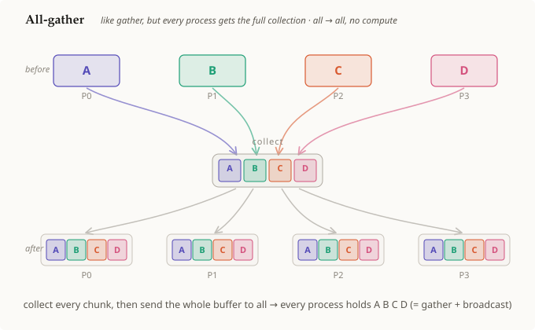

# 올게더

## 요약

**올게더(all-gather)**는 **[[gather]] 다음에 [[broadcast]]가 이어지는 것**이다. 모든
프로세스가 자신의 청크(chunk)를 내놓으면, 그 청크들이 하나의 전체 버퍼로 모이고, 그런
다음 루트 하나가 아니라 **모든** 프로세스가 그 완전한 버퍼를 받는다. 이는 올리듀스가
리듀스에 대해 갖는 관계와 같다. 즉 수집 방식은 동일하지만 결과가 모든 곳에 도달한다는
점이 다르다. 결정적으로 이 연산은 데이터를 *옮길* 뿐 아무것도 결합하지 않으므로, 각
청크는 자신의 정체성을 그대로 유지한다.

## 상세 설명

올게더는 브레인에 이미 존재하는 두 개의 집합 연산(collective)을 합성한 것이다.

1. **게더 부분.** [[gather]]에서처럼, 각 랭크의 청크가 랭크 순서대로 하나의 버퍼로
   수집된다. 그림에서는 `A B C D`가 그것이다.
2. **브로드캐스트 부분.** 그렇게 완성된 전체 버퍼는 [[broadcast]]에서처럼 **모든**
   랭크에게 전송된다. 그 결과 최종 상태는 `P0 = P1 = P2 = P3 = [A B C D]`가 되며,
   버퍼가 루트에만 남아 있지 않는다.

각 조각은 **구분된 상태를 유지**한다. 그림에서 네 가지 색이 나란히 남아 있는 이유는
올게더가 *수집*을 할 뿐, 결코 리덕션 연산(reduction operation)을 적용하지 않기
때문이다. 이것이 올리듀스와의 유일한 차이다.

- **올리듀스**는 기여된 값들을 하나의 계산된 결과(호박색 `17` 하나)로 접어서 모두에게
  전달한다.
- **올게더**는 기여된 모든 값을 그대로 유지한 채, 이어붙인 전체 컬렉션을 모두에게
  전달한다.

두 경우 모두 최종적으로는 모든 랭크가 동일한 것을 갖게 되는데, 그 "동일한 것"이
*결합된* 것인지(올리듀스) *수집된* 것인지(올게더)만 다르다. (올리듀스와 마찬가지로,
실제 구현에서는 문자 그대로 게더 후 브로드캐스트를 하기보다 링(ring) 방식을 쓰지만,
의미상으로는 정확히 이 두 연산을 합성한 것이다.)

## 선행 개념

- [[gather]]
- [[broadcast]]

## 출처

_없음_
