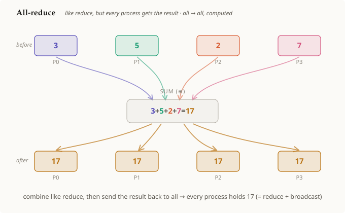

# 올리듀스

## 요약

**올리듀스(all-reduce)**는 **[[reduce]] 다음에 [[broadcast]]가 이어지는 것**이다. 모든
프로세스가 값을 하나씩 내놓으면 그 값들이 하나의 결과로 결합되고, 그런 다음 루트
하나가 아니라 **모든** 프로세스가 그 결과를 받는다. 리듀스와 결합 방식은 동일하지만
답이 모든 곳에 도달한다는 점이 다르다. 이는 분산 ML 학습의 주력 집합 연산(collective)
으로, 각 스텝의 그레이디언트를 모든 GPU에 걸쳐 평균 내는 데 쓰인다.

## 상세 설명

올리듀스는 브레인에 이미 존재하는 두 개의 집합 연산으로 구성된다.

1. **리듀스 부분.** [[reduce]]에서와 정확히 같이, 모든 랭크의 값이
   [[reduction-operation]]에 의해 하나의 결과로 접힌다. 그림에서는
   `3 + 5 + 2 + 7 = 17`이다(여기서는 연산이 합(sum)이지만, 최댓값·최솟값·곱 등 결합
   법칙을 만족하는 어떤 연산이든 마찬가지로 동작한다). `17`은 *계산된* 값이므로 어떤
   프로세스의 데이터 색이 아니라 호박색 "결과" 색을 띤다.
2. **브로드캐스트 부분.** 그 결과는 [[broadcast]]에서처럼 **모든** 랭크에게 전송된다.
   그 결과 최종 상태는 `P0 = P1 = P2 = P3 = 17`이 되며, 결과가 루트에만 남아 있지
   않는다.

따라서 [[reduce]]와의 차이는 순전히 목적지에 있다. **리듀스**는 답을 한 프로세스에만
남기고, **올리듀스**는 답을 모든 프로세스에 남긴다. (실제로는 문자 그대로 리듀스 후
브로드캐스트를 하는 것보다 링(ring) 알고리즘처럼 더 영리하게 구현되지만, *의미로서는*
정확히 이 두 연산을 합성한 것이다.)

이것이 ML에서 지배적으로 쓰이는 이유: 데이터 병렬(data-parallel) 학습에서 각 GPU는
자신의 배치로부터 그레이디언트를 계산하고, 올리듀스는 **그 그레이디언트들을 합산(또는
평균)해서 동일하게 결합된 그레이디언트를 모든 GPU에 돌려준다**. 그래서 모든 복제본이
동일한 업데이트를 적용하며 동기 상태를 유지한다.

## 선행 개념

- [[reduce]]
- [[broadcast]]
- [[reduction-operation]]

## 출처

_없음_
