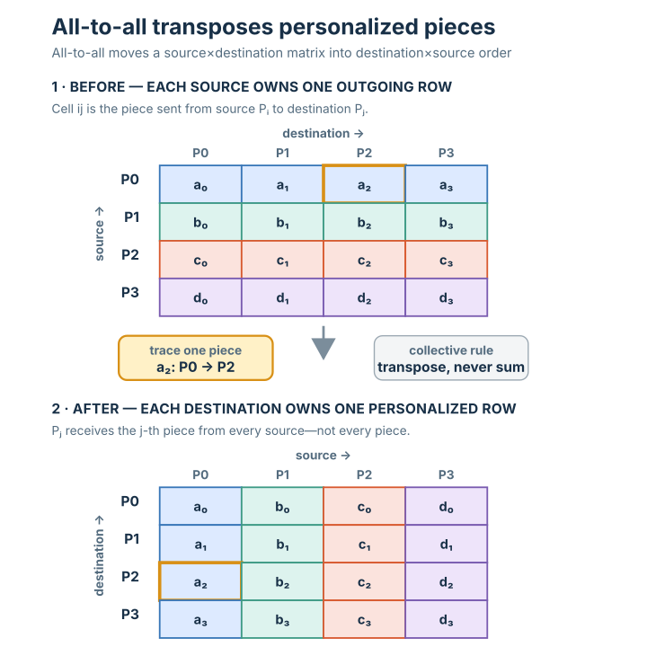

# All-to-all

## Summary

**All-to-all** is the collective in which **every process sends a different chunk to
every other process** — and receives a different chunk back from each. If you write
the data as a matrix (rows = source, columns = destination), all-to-all is its
**transpose**: what was process *i*'s *j*-th chunk becomes process *j*'s *i*-th chunk.
It is the most communication-heavy collective — every pair of processes exchanges
data — and it only moves data, nothing is combined.

## Grounded explanation

All-to-all is best understood as **[[scatter]] and [[gather]] happening from every
process at once**:

1. **Every process acts like a scatter root — for its own row.** In [[scatter]] *one*
   root deals a different chunk to each rank. In all-to-all *every* process does this
   simultaneously: process *i* holds a row of chunks `[i→0, i→1, i→2, i→3]` and sends
   chunk `i→j` to process *j*. (In the figure, P0 sends `a0` to itself, `a1` to P1,
   `a2` to P2, `a3` to P3.)
2. **Every process acts like a gather sink — for its own column.** Symmetrically, what
   each process *receives* is one chunk from every source — exactly a [[gather]] of the
   *j*-th chunk out of each row. Process *j* ends up holding `[0→j, 1→j, 2→j, 3→j]`.
3. **Net effect: a transpose.** Reading the chunks as a matrix `M[source][dest]`, the
   send rule "`M[i][j]` goes from *i* to *j*" turns row *i* into column *i*. So rows of
   *outgoing* data become columns of *incoming* data — the colours in the figure show
   it: each before-row is one colour (one source), each after-column mixes all four
   colours (one chunk from every source).

The contrast with [[all-gather]] is the key: [[all-gather]] gives **everyone the same
full collection**; all-to-all gives **everyone a *personalized* selection** — process
*j* keeps only the *j*-th piece from each source, not the whole thing. That
personalization is why it costs the most: `n × n` distinct messages rather than one
shared buffer.

## Prerequisites

- [[scatter]]
- [[gather]]
- [[all-gather]]

## Sources

_none_
