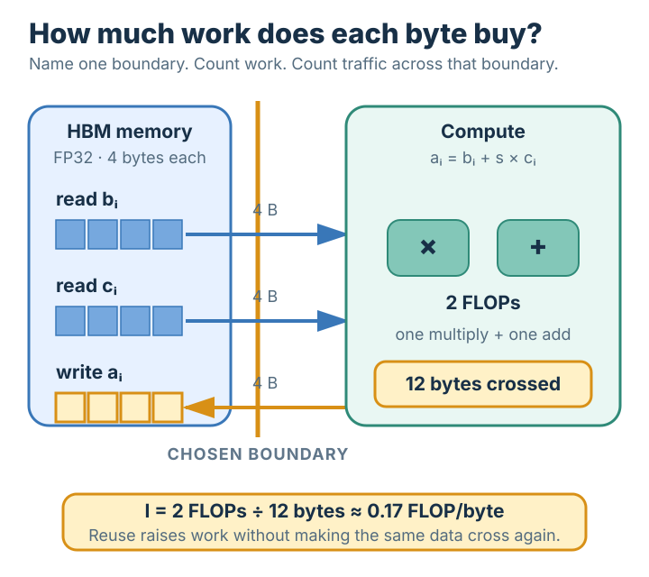

# Arithmetic Intensity

## Summary

**Arithmetic intensity** says how much numerical work a computation extracts from the
data it transfers. Count the operations performed, count the bytes crossing one stated
memory boundary, and divide the first count by the second. A low value means each byte
supports little work; a high value means transferred data is reused for many operations.
The number is meaningful only when the operation-counting convention and the memory
boundary are stated.

## Grounded explanation

### The quantity: work divided by traffic

Arithmetic intensity combines two ordinary counts using division from [[arithmetic]].

| Symbol | Shape | Meaning | Unit |
|---|---|---|---|
| $W$ | scalar | numerical operations performed | operations |
| $Q$ | scalar | data transferred across the chosen boundary | bytes |
| $I$ | scalar | arithmetic intensity | operations per byte |

$$
I = \frac{W}{Q}.
$$

For floating-point work, $W$ is commonly counted in FLOPs: one FLOP is one
floating-point arithmetic operation. An instruction that combines a multiplication and
an addition is conventionally counted as two FLOPs. The byte count $Q$
depends on the [[numeric-precision-formats]] used: one FP32 value occupies 4 bytes,
whereas one FP16 value occupies 2 bytes.

The denominator needs one precise boundary. For example, an HBM-level intensity counts
bytes transferred between main device memory and the processor. A cache-level intensity
counts traffic across that cache boundary instead. Source-code loads are not automatically
equal to transferred bytes: a value kept nearby and reused may cross the chosen boundary
once even though the program uses it many times, while an implementation that repeatedly
fetches the value makes it cross more than once.

### Worked instance: vector triad

Consider the element-wise calculation

$$
a_i = b_i + s \times c_i
$$

for $N = 1{,}000{,}000$ elements, where every value uses FP32. Each element performs one
multiplication and one addition, so

$$
W = 2N = 2{,}000{,}000\ \text{FLOPs}.
$$

Assume each input is read once and each output is written once across the stated memory
boundary. The calculation reads $b_i$ and $c_i$, reads the scalar $s$ once, and writes
$a_i$. The scalar contributes only 4 bytes, while the three vectors contribute

$$
Q = 3N \times 4 + 4 = 12{,}000{,}004\ \text{bytes}.
$$

Therefore

$$
I = \frac{2{,}000{,}000}{12{,}000{,}004}
  \approx 0.167\ \text{FLOP/byte}.
$$

Every transferred byte supports only about one sixth of a floating-point operation. If a
different implementation causes both input vectors to cross the boundary twice, $W$
stays fixed but $Q$ grows by another 8,000,000 bytes, so the measured intensity falls.
Conversely, keeping a loaded value nearby and using it in additional operations raises
$W$ without repeating its transfer, so intensity rises.

### What the ratio does and does not say

Arithmetic intensity describes a computation or a particular implementation; it does not
report speed by itself. It exposes **data reuse**: increasing reuse performs more
work for the same traffic, while unnecessary traffic lowers the ratio. Hardware models can
compare this workload quantity with a processor's own operation-rate-to-bandwidth ratio to
predict which resource may limit performance. That comparison is a separate step; the
definition here remains simply work divided by bytes across an explicit boundary.

## Prerequisites

- [[arithmetic]]
- [[numeric-precision-formats]]

## Sources

- Williams, Waterman, and Patterson, “Roofline: An Insightful Visual Performance Model for Floating-Point Programs and Multicore Architectures” — introduces operational intensity as operations per byte of memory traffic.
- Lawrence Berkeley National Laboratory, “The Roofline Model: Visualizing and Optimizing Performance” — defines arithmetic intensity as total floating-point work divided by total data movement.
- NVIDIA, “GPU Performance Background User's Guide” — derives arithmetic intensity and explains its implementation-traffic and utilization assumptions.
