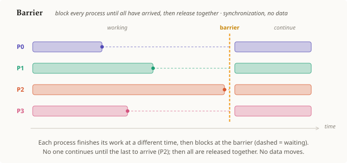

# Barrier

## Summary

**Barrier** is the [[collective-operation]] that **synchronizes** the group: every
process that reaches the barrier **blocks** until *all* processes have reached it, and
only then is everyone released to continue. It is the one collective that moves **no
data at all** — its entire effect is on *timing*: it guarantees that no process runs
ahead of the others past this point.

## Grounded explanation

Every [[collective-operation]] already requires that all ranks call it before it can
complete. Barrier is the collective that keeps **only** that property and drops the data:

1. **Each rank arrives when it arrives.** Processes run independently, so they reach the
   barrier at different times — in the figure P0 finishes its work early, P2 last.
2. **Early arrivers block.** A process that reaches the barrier waits (the dashed
   segments) instead of proceeding. It cannot continue while any rank is still behind.
3. **Release together.** Once the **last** rank arrives (P2), the barrier lifts and all
   processes resume at once. After the barrier, every rank is known to be past this
   point — the program's two sides of the barrier never overlap in time.

Because nothing is sent or computed, the figure deliberately uses a **timeline** layout
(time on the horizontal axis, one lane per process) rather than the before→after data
diagram of the other collectives — the mechanism here is purely *when* things happen, so
the picture shows time. Barrier is used to impose ordering: e.g. "everyone must finish
writing before anyone starts reading."

## Prerequisites

- [[collective-operation]]

## Sources

_none_
