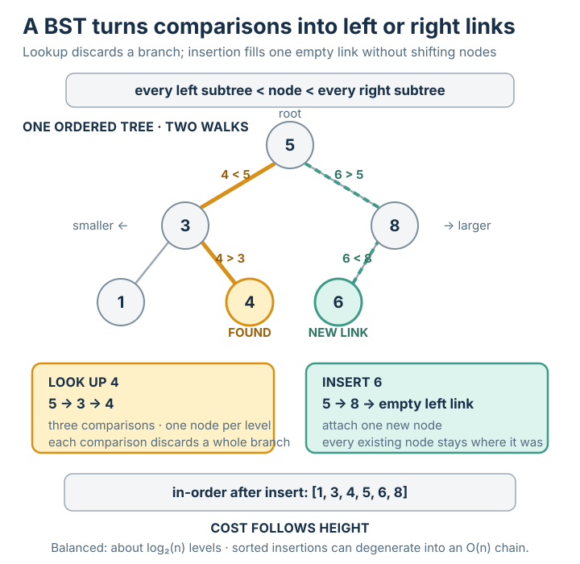

# 이진 탐색 트리

## 요약

이진 탐색 트리(binary search tree, BST)는 순서 있는 데이터를 연속된 배열이 아니라 링크로 연결된 노드들의 가지치기 구조로 저장하되, [[binary-search]]의 반감(halving) 아이디어가 그 구조 자체에서 작동하도록 배열한 것이다. 각 노드는 키 하나를 담고 최대 두 개의 자식 — 왼쪽과 오른쪽 — 으로의 링크를 가지며, 단 하나의 규칙, 즉 *BST 성질*을 따른다: 어떤 노드의 왼쪽 가지에 있는 모든 키는 그 노드의 키보다 작고, 오른쪽 가지에 있는 모든 키는 더 크다. 무언가를 찾으려면 꼭대기에서 시작해 각 노드에서 비교하고 왼쪽 또는 오른쪽으로 내려가며, 비교 한 번마다 가지 하나를 통째로 버린다 — `n`개의 키에 대해 약 `log2(n)` 단계로, 정확히 [[binary-search]]의 속도다. 정렬된 배열 대비 결정적인 이득은 BST가 *삽입*과 *삭제*도 약 `log2(n)` 단계에 해낸다는 점이다: 링크 하나만 조정해 새 노드를 제자리에 끼워 넣으며, 다른 원소를 밀어내는 일이 없다. 그것이 이 구조의 존재 이유다 — 데이터가 변할 때 조회와 갱신을 둘 다 빠르게 유지한다. 정렬된 배열은 조회는 빨랐지만 삽입이 느렸다.

## 상세 설명

**이 구조가 답하는 문제, 그리고 정렬된 배열이 왜 부족한가.** [[binary-search]]는 빠른 조회를 제공한다 — 약 `log2(n)`번의 비교로, 여기서 `log2(n)`은 개수 `n`을 1까지 절반씩 줄일 수 있는 횟수다 — 하지만 *정렬된 배열*, 즉 값들이 인접한 번호 붙은 칸에 증가 순서로 놓인 줄에서만 가능하다. [[binary-search]]에서 언급했듯 그 배치에는 약점이 있다. 새 값이 *어디에* 들어가야 하는지 찾는 것은 싸지만(`log2(n)`번의 비교), 실제로 *삽입하는* 것은 그렇지 않다: 삽입 지점 뒤에 있는 모든 값이 자리를 열기 위해 한 칸씩 밀려야 하며, 이는 최대 `n`번의 이동에 해당하는 작업이다. 따라서 정렬된 배열은 데이터가 고정되어 있을 때는 탁월하지만 값들이 계속 도착해 순서 없이 끼워 넣어져야 할 때는 비용이 크다. 이진 탐색 트리는 빠른 조회를 유지하면서 이 약점을 제거하는 구조다.

**중심 대상: 링크로 연결된 노드들의 트리.** *노드(node)*는 하나의 *키(key)*(저장되는 값)와 *자식(children)*이라 불리는 두 개의 링크 — *왼쪽 자식*과 *오른쪽 자식* — 를 담는 작은 레코드다. 링크는 비어 있을 수 있으며, 이는 "그쪽에 자식이 없다"를 뜻한다. 한 노드는 *루트(root)* — 위에 아무것도 없는 유일한 진입점 — 다. 링크를 아래로 따라 읽으면 모든 노드는 바로 위의 정확히 하나의 노드(그 노드의 *부모(parent)*)에서 도달되며, 링크를 따라가도 결코 되돌아 순환하지 않는다; 이 아래로 가지 치는, 순환 없는 형태가 여기서 *트리(tree)*라는 단어가 가리키는 것이다. 자식이 없는 노드는 *리프(leaf)*다. 어떤 노드의 *깊이(depth)*는 루트에서 그 노드까지 건너는 링크의 수이고(루트의 깊이는 `0`), 트리의 *높이(height)*는 가장 깊은 노드의 깊이다 — 조회 비용은 결국 이 높이에 좌우된다.

**정의 규칙: BST 성질.** 키는 임의로 배치되지 않는다. 트리의 *모든* 노드에 대해, 그 노드의 왼쪽 자식 가지 어디에 저장된 키든 그 노드 자신의 키보다 *작고*, 오른쪽 가지 어디의 키든 *크다*는 규칙이 성립한다. ("가지(branch)"란 해당 노드와 그 아래로 도달 가능한 모든 것을 뜻한다.) 모든 노드에서 동시에 적용되는 이 단 하나의 규칙이 *BST 성질*이며, "배열이 정렬되어 있다"에 해당하는 트리 쪽 대응물이다. 한 노드에서의 비교 한 번이 가지 하나 전체를 배제할 수 있게 해 주는 것이 바로 이 성질이다 — 정렬성이 [[binary-search]]로 하여금 배열의 절반을 버리게 해 준 것과 같은 논리다.

**조회의 한 단계, 그리고 왜 가지 하나를 통째로 버리는가.** 어떤 키가 존재하는지 찾으려면 루트에서 시작해 한 단계를 반복한다. 찾는 키를 현재 노드의 키와 비교한다. 세 가지 결과가 있다:

- 둘이 *같다* — 탐색 성공; 이 노드가 그 키를 담고 있다.
- 찾는 키가 *작다*. BST 성질에 의해 오른쪽 가지의 모든 키는 이 노드의 키보다 크고, 따라서 찾는 것보다 크므로 어느 것도 일치할 수 없다; 오른쪽 가지 전체를 버리고 왼쪽 자식으로 내려간다.
- 찾는 키가 *크다*. 대칭적으로, 왼쪽 가지 전체는 너무 작아 일치할 수 없다; 그것을 버리고 오른쪽 자식으로 내려간다.

따라가야 할 링크가 비어 있으면 그 키는 없는 것이다. 비교 한 번마다 가지 하나를 버리고 한 레벨 내려가므로, 탐색은 레벨당 노드 하나를 방문한다 — 많아야 *높이*만큼의 노드다. 이는 [[binary-search]]의 "비교 한 번이 후보의 절반을 없앤다"와 같은 메커니즘이다; 차이는 그 절반들이 이제 배열 인덱스 범위의 절반이 아니라 링크된 트리의 가지라는 것뿐이다. 트리 모양이 좋으면 각 가지는 남은 키의 대략 절반을 담으므로, 높이는 약 `log2(n)`이고 조회는 약 `log2(n)`번의 비교가 든다.

**결정적인 승리: 삽입에 밀어내기가 없다.** 여기서 트리가 정렬된 배열을 이긴다. 새 키를 삽입하려면 그 키를 찾을 때와 완전히 같은 하강 걷기를 수행한다. 각 노드에서 비교하고 왼쪽 또는 오른쪽으로 내려가다가 *빈* 링크 — 그 키가 존재했다면 발견되었을 자리 — 에 도달한다. 그 빈 링크 하나를 채워 새 노드를 거기에 놓는다. 트리의 다른 어떤 것도 움직이지 않는다; 링크 하나를 조정했을 뿐이다. 이 걷기는 비교 한 번당 한 레벨 내려가므로 약 `log2(n)`의 작업 — 조회와 같다 — 이고, 결정적으로 기존 노드의 *밀어내기가 없다*. 정렬된 배열에서는 칸 하나를 여는 데 최대 `n`개의 원소가 밀려야 했던 것과 대비하라. 이것이 정확히 출처가 순서 있는 로그 저장소의 두 경우 사이에서 그리는 트레이드다: 타임스탬프가 "증가하는 순서로 도착"할 때(Case A)는 덧붙이기만 하는 정렬 배열로 충분하지만, "타임스탬프가 순서 없이 도착할 수 있을" 때(Case B)는 "일반 배열은 [정렬 상태를] 싸게 [유지할] 수 없고", *균형 탐색 트리*(아래에서 정의하는, 모양을 좋게 유지한 BST)가 삽입과 선행자 질의 *둘 다*에 `O(log n)`을 준다. 표기 `O(log n)`은 그저 "`log2(n)`처럼 증가한다"는 뜻이다 — 비용이 `n` 자체만큼이 아니라 반감 횟수만큼만 빨리 오른다. 삭제도 같은 정신을 따른다: 노드를 찾은 뒤 BST 성질이 계속 성립하도록 그 자식들을 다시 링크하며, 역시 배열을 밀어내는 대신 그 노드 근처의 링크만 건드린다.

**순서 연산은 덤으로 온다.** BST 성질이 키를 공간적으로 정렬하므로 — 작은 것은 왼쪽, 큰 것은 오른쪽 — "왼쪽 가지의 모든 것, 그다음 이 노드, 그다음 오른쪽 가지의 모든 것" 순서로 트리를 재귀적으로 방문하면 키가 증가 순서로 나온다. 이 *중위 순회(in-order traversal)*는 별도의 정렬 없이 정렬된 목록을 낸다. 같은 순서 덕에 이웃 질의도 싸진다: *후속자(successor)*(다음으로 큰 저장 키)와 *선행자(predecessor)*(다음으로 작은 키 — 출처가 로그 저장소에 대해 던지는 바로 그 선행자 질의)는 짧은 걷기로 찾고, *범위 질의(range query)* — 두 경계 사이의 모든 키 — 는 한 경계까지 걸어간 뒤 다른 경계까지 중위 순회로 훑는 것이다. 트리 모양이 좋으면 이 모두가 `log2(n)` 근처에 머문다. (*이진 탐색 트리*를 *힙(heap)*과 혼동해서는 안 된다. 힙은 다른 이진 트리 구조로, 그 규칙은 각 노드를 자식들과 크기로만 관련지을 뿐 정렬된 순서를 주지 않는다; 여기서 쓰이는 BST 성질은 왼쪽-작음/오른쪽-큼이라는 더 강한 규칙이다.)

**함정, 그리고 그것을 고치는 것.** 위의 조회·삽입 비용은 모두 "트리 모양이 좋을 때 약 `log2(n)`" — 즉 높이가 `log2(n)` 근처에 머무를 때 — 로 서술되었다. BST 성질의 어떤 것도 그것을 강제하지 않는다. 키가 *이미 정렬된 순서로* 삽입되면 — 예컨대 `1`, 그다음 `2`, `3`, `4` — 각 새 키는 이전의 모든 키보다 크므로 항상 직전 노드의 오른쪽 자식으로 붙는다. 트리는 가지치기가 전혀 없는 오른쪽 방향의 단일 사슬 — 리스트 모양의, 높이 `n - 1`짜리 구조 — 가 된다. 그러면 조회는 `n`개의 노드를 전부 걸어 `O(n)`의 비용이 들고 이점이 사라진다. 이 *퇴화(degenerate)* 사례가 일반 BST가 이야기의 끝이 아닌 이유다. *균형(balanced)* 탐색 트리 — AVL 트리, 레드-블랙 트리 같은 변종들 — 는 삽입 시 어떤 가지가 너무 높이 자라는 것을 감지해 국소적으로 재구성(링크 몇 개를 회전)하는 장부 관리를 더해 높이를 `log2(n)` 근처에 고정하고, 도착 순서와 무관하게 조회·삽입·삭제에 `O(log n)`을 보장한다. 이것이 출처의 Case B가 찾는 "균형 탐색 트리"다. 균형 유지의 세부 메커니즘은 그 자체로 별도의 주제다; 여기서의 요점은 그것이 사 주는 보장이다.

**트레이드를 있는 그대로 말하면.** [[binary-search]]를 얹은 정렬 배열은 빠른 `O(log n)` 조회와 느린 `O(n)` 삽입을 준다 — 미리 고정된 *정적* 데이터에 이상적이다. 균형 이진 탐색 트리는 조회와 삽입 *둘 다*에 `O(log n)`을 준다 — 시간에 따라 변하는 *동적* 데이터, 즉 순서 없이 도착하는 Case B에 이상적이다. 배열의 조밀한, 삽입 시 밀어내는 배치를 링크된, 삽입 시 끼워 넣는 배치와 맞바꾸고, 그 대가로 삽입이 더 이상 느린 연산이 아니게 된다.

**작동 예시.** 빈 트리에 키 `5, 3, 8, 1, 4`를 그 순서대로 삽입한다. (이 키들은 트리가 사슬로 퇴화하지 않고 실제로 가지 치도록 일부러 미리 정렬하지 않은 것이다.)

- `5` 삽입: 트리가 비어 있으므로 `5`가 루트가 된다.
- `3` 삽입: 루트 `5`와 비교; `3 < 5`이므로 왼쪽으로; 왼쪽 링크가 비어 있으므로 `3`이 루트의 왼쪽 자식이 된다.
- `8` 삽입: `5`와 비교; `8 > 5`이므로 오른쪽으로; 오른쪽 링크가 비어 있으므로 `8`이 루트의 오른쪽 자식이 된다.
- `1` 삽입: `5`와 비교(`1 < 5`, 왼쪽의 `3`으로); `3`과 비교(`1 < 3`, 왼쪽으로); 비어 있으므로 `1`이 `3`의 왼쪽 자식이 된다.
- `4` 삽입: `5`와 비교(`4 < 5`, 왼쪽의 `3`으로); `3`과 비교(`4 > 3`, 오른쪽으로); 비어 있으므로 `4`가 `3`의 오른쪽 자식이 된다.

결과 트리: 루트 `5`에 왼쪽 자식 `3`과 오른쪽 자식 `8`; `3`에는 다시 왼쪽 자식 `1`과 오른쪽 자식 `4`; `8`은 리프다. 루트에서 BST 성질을 확인해 보자: 왼쪽 가지는 `{3, 1, 4}`를 담는데 전부 `5`보다 작고, 오른쪽 가지는 `{8}`로 더 크다. 노드 `3`에서: 왼쪽 가지 `{1}`은 더 작고, 오른쪽 가지 `{4}`는 더 크다. 규칙이 모든 곳에서 성립한다.

이제 `4`를 *조회*한다. 루트 `5`에서 시작: `4 < 5`, 왼쪽의 `3`으로. `3`에서: `4 > 3`, 오른쪽의 `4`로. `4`에서: 같다 — 발견. 비교 세 번, 각각 한 레벨씩 내려가는, 정확히 위에서 설명한 가지 버리기 걷기다.

이제 트리를 *중위 순서로* 읽는다 — 왼쪽 가지, 노드, 오른쪽 가지를 재귀적으로. 루트에서: 먼저 왼쪽 가지(그 자체가 `1`, 그다음 `3`, 그다음 `4`를 낸다), 그다음 루트 `5`, 그다음 오른쪽 가지(`8`). 출력은 `1, 3, 4, 5, 8` — 정렬 단계 없이 만들어진 정렬 결과다.

마지막으로 `6`을 *삽입*한다. 아래로 걷는다: `5`에서 `6 > 5`, 오른쪽의 `8`로; `8`에서 `6 < 8`, 왼쪽으로; 그 링크가 비어 있으므로 `6`이 `8`의 왼쪽 자식이 된다. 비교 두 번, 새 링크 하나 채움, 그리고 기존 노드는 단 하나도 움직이지 않았다 — 정렬 배열이 제공할 수 없었던 `O(log n)`, 무(無)밀어내기 삽입이다.

## 선행 개념

- [[binary-search]]

## 출처

- `etc/study-notes.html` — "An ordered log store and the predecessor query," Case A 대 Case B: 타임스탬프가 순서 없이 도착할 때 "일반 배열은 [정렬 상태를] 싸게 [유지할] 수 없으므로" 삽입 *과* 선행자 질의 모두 `O(log n)`이 되도록 "균형 탐색 트리를 사용하라" — 이 노드가 정렬 배열의 `O(n)` 삽입에 맞서 쌓아 올리는 트레이드.
