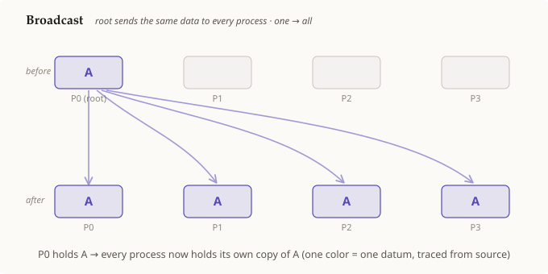

# 브로드캐스트

## 요약

**브로드캐스트(broadcast)**는 **한** 프로세스, 즉 [[root-process]]가 데이터 한
조각을 가지고 있고, 호출이 끝난 뒤에는 그룹 내 **모든** 프로세스가 그것과 동일한
사본을 갖게 되는 [[collective-operation]]이다. 이는 가장 단순한 집합 연산이다. 순수한
**하나 → 전체** 이동이며 계산은 전혀 없다. 데이터는 단일 출처에서 흘러나갈 뿐,
결합되거나 변경되지 않는다.

## 상세 설명

[[collective-operation]]은 그 *형태*, 즉 누가 데이터를 기여하고 누가 결과를 받는지로
정의된다. 브로드캐스트의 형태는 가장 한쪽으로 치우쳐 있다. **[[root-process]]가 유일한
기여자이고, (루트를 포함한) 모든 랭크가 수신자다.**

1. **시작 상태.** 오직 루트만 값을 가지고 있으며, 다른 랭크의 버퍼는 비어 있거나
   정의되지 않은 상태다. 그림에서는 P0가 루트이고 `A`를 가지고 있다.
2. **연산.** 그룹 내 모든 랭크가 동일한 루트를 지정하여 브로드캐스트를 호출한다.
   루트는 *전송*하고, 나머지는 *수신*한다. 집합 연산으로서 이는 모든 랭크가 참여할
   때까지 끝나지 않는다.
3. **종료 상태.** 각 랭크는 이제 값의 **자기 자신의 사본**을 갖게 된다. 이는
   프로세스들이 결코 메모리를 공유하지 않고 오직 사본만 받는다는 규칙과 일치한다.
   그림 속 단일 색상은 하나의 데이터가 출처에서 모든 목적지까지 추적됨을 나타낸다.

이면을 보면 이는 그저 [[collective-operation]]의 여러 점대점(point-to-point)
전송이 루트로부터 팬아웃(fan-out)되는 형태로 배열된 것일 뿐이다(실제로는 트리 구조를
써서 비용이 `n`이 아니라 `log n`으로 늘어난다). 이 추상화 덕분에 프로그래머는 각
랭크의 수신을 손으로 배선하는 대신 호출 하나만 작성하면 된다.

`root-process`는 현재 프런티어(frontier)에 있다. 이것이 정리(archive)되면, 이 노드의
설명은 [[collective-operation]]까지 이어져 병렬-프로세스 바닥까지 닫히게 된다.

## 선행 개념

- [[collective-operation]]
- [[root-process]]

## 출처

_없음_
