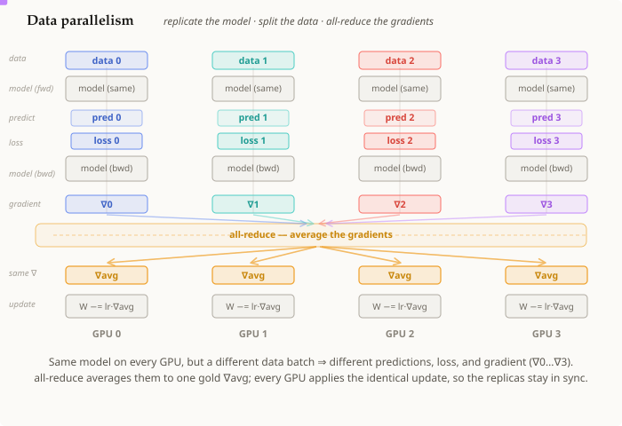

# 데이터 병렬성

## 요약

**데이터 병렬성(data parallelism)**은 모든 GPU에 **같은 [[neural-network]]의 완전한 사본**을
두고, 각 사본에 데이터 배치의 **다른 조각**을 주며, [[all-reduce]]로 그래디언트를 매 스텝
**합쳐서** 사본들을 동일하게 유지함으로써 학습을 확장한다. 각 GPU는 자신의 데이터에 대해
[[gradient-descent]]를 수행하고, 그 뒤 all-reduce가 그래디언트들을 평균 내어 모든 복제본이 *같은*
업데이트를 적용하게 만든다. 모델이 아니라 **배치**를 확장하는 것이므로, 이는 모델이 GPU 하나에 다
들어갈 때만 작동한다.

## 상세 설명

이는 두뇌의 두 갈래 — [[neural-network]]/[[gradient-descent]] 쪽과 [[all-reduce]](MPI) 쪽 — 를
처음으로 잇는 개념이다:

1. **모델을 복제한다.** 모든 GPU는 *같은* 가중치를 지닌 *같은* [[neural-network]]를 지닌다.
   (그림에서 모든 "모델" 상자는 동일하며/회색으로 표시된다.)
2. **데이터를 나눈다.** 각 GPU는 서로 다른 배치를 받아 순전파를 수행하고, **서로 다른** 예측과
   손실을 얻는다 — 데이터가 다르기 때문이지 모델이 다른 게 아니다. 그래서 각 GPU의
   [[gradient-descent]] 스텝은 **서로 다른 그래디언트** `∇ᵢ`를 계산한다.
3. **그래디언트를 all-reduce한다.** 여기가 핵심이다: 각 GPU가 자신의 `∇ᵢ`만 적용한다면, 복제본들은
   서로 갈라져버릴 것이다. 대신 [[all-reduce]]가 모든 그래디언트를 하나의 평균 `∇avg`로 합쳐서
   *같은* `∇avg`를 모든 GPU에 건네준다(그림에서 금색 스텝). 그래디언트를 평균 내는 것은 수학적으로
   전체 결합 배치의 그래디언트와 같다.
4. **동일한 업데이트.** 모든 GPU가 `W -= lr · ∇avg`, 즉 **같은** 업데이트를 적용하므로, 같게
   시작했던 복제본들은 **계속 같게** 유지된다. 다음 스텝은 어디서나 동일한 모델에서 시작한다.

**비용과 실패 지점.** 통신은 스텝당 전체 그래디언트에 대한 [[all-reduce]] 한 번이다(규모가 크면
그 자체로 큼). 그리고 모든 GPU는 여전히 모델 *전체*와 그 그래디언트, 옵티마이저 상태까지 저장한다
— 그래서 데이터 병렬성만으로는 모델이 더 이상 GPU 하나에 들어가지 않는 순간 무너진다. (이 한계가
바로 텐서 병렬성, 파이프라인 병렬성, FSDP/ZeRO가 풀기 위해 존재하는 문제이며 — 이 갈래의 다음
노드들이다.)

## 전제 조건

- [[neural-network]]
- [[gradient-descent]]
- [[all-reduce]]

## 출처

_없음_
