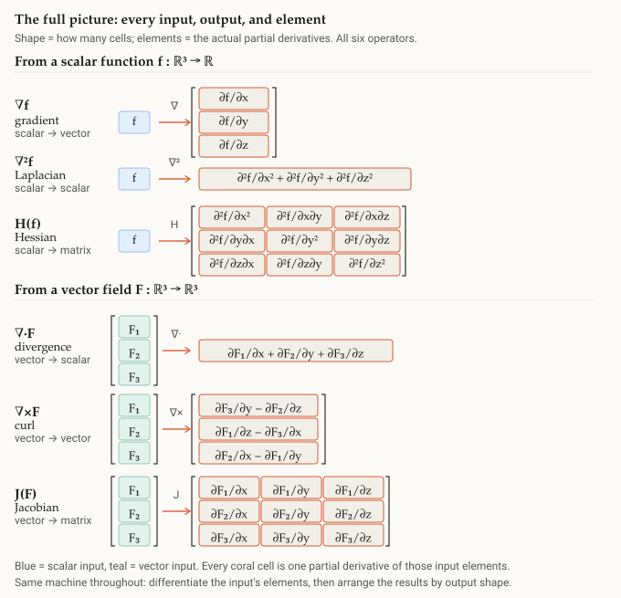

# Differential operators

## Summary

Gradient, divergence, curl, Laplacian, Jacobian, Hessian — **six names, one
machine**: take the [[del-operator]] $\nabla$, combine it with a field through a
product, then optionally compose.

## Grounded explanation

The whole family comes from one building block and two moves:

- **Three products** with a field: scalar-multiply → [[gradient]] (scalar→vector),
  dot → [[divergence]] ([[vector-field]]→scalar), cross → [[curl]] (vector field→vector).
- **Two compositions / full derivatives:** gradient then divergence → [[laplacian]]
  ($\nabla\cdot\nabla$); the [[jacobian]] is the [[differential]] generalized to a
  vector-valued function (one row per output), and the [[hessian]] is the Jacobian of the gradient.

What changes across them is only the **shape** of the output — a column, a single
summed cell, or a full grid — while every coral cell is one partial-derivative
of the input's elements. (This is the "package" installed from the
differential-operators atlas.)

## Prerequisites

- [[del-operator]]
- [[gradient]]
- [[divergence]]
- [[curl]]
- [[laplacian]]
- [[jacobian]]
- [[hessian]]
- [[vector-field]]
- [[differential]]

## Figure

## Sources

- etc/differential-operators-summary.html
