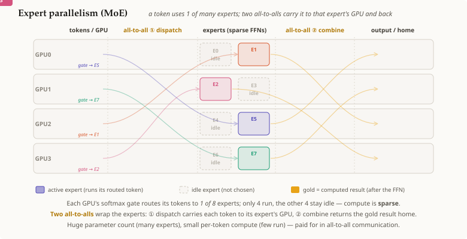

# 전문가 병렬성 (MoE)

## 요약

[[mixture-of-experts]] 레이어는 **많은** 전문가 FFN을 지니고 각 토큰을 그중 **소수**에게만
라우팅한다. **전문가 병렬성(Expert Parallelism, EP)**은 그 레이어를 여러 GPU에 걸쳐 *실행하는*
방법이다: 서로 다른 전문가들을 서로 다른 GPU에 배치한다. 토큰이 선택한 전문가는 보통 **다른** GPU에
살고 있으므로, 라우팅된 토큰들은 그곳으로 보내졌다가 다시 돌아와야 하며 이는 **두 번의
[[all-to-all]]**로 이루어진다 — **디스패치(dispatch)**(각 토큰을 그 전문가의 GPU로 보냄), 그리고
**결합(combine)**(각 결과를 원래 자리로 돌려보냄). EP는 그 특징적인 집합 통신(collective)이
all-reduce가 아니라 all-to-all인 병렬화 전략이다.

## 상세 설명

[[mixture-of-experts]]에서 출발하자: 라우터는 이미 각 토큰의 상위 k개 전문가를 골라두었고, 토큰당
연산은 희소하다. **EP가 새로 들여오는 유일한 문제는 지역성(locality)**이다 — 전문가 FFN들이
여러 GPU에 흩어져 있으므로, 라우팅된 토큰들은 *이동*해야 한다. 레이어마다:

1. **All-to-all #1 — 디스패치.** 각 전문가는 하나의 GPU에 산다. 모든 GPU는 동시에 자신이 가진
   각 토큰을, 그 토큰의 전문가를 소유한 GPU로 보낸다 — 모든 프로세스가 다른 모든 프로세스로 서로
   다른 청크를 보내는 것이 정확히 [[all-to-all]]이다. 그 뒤 각 GPU는 자신의 **로컬** 전문가들이
   처리해야 할 토큰들만 정확히 보유하게 된다.
2. **전문가 연산.** 각 GPU는 도착한 토큰들에 대해 자신의 로컬 전문가들을 실행한다 — 두 축 모두
   희소하다(라우팅된 토큰만, 로컬 전문가만).
3. **All-to-all #2 — 결합.** 출력들은 왔던 길을 되짚어 되돌려보내진다 — 두 번째
   [[all-to-all]]이다 — 그래서 각 토큰의 결과는 자신의 출발지로 돌아가고, 전체 시퀀스는 다음
   레이어를 위해 어디서든 재구성된다.

그래서 EP는 [[mixture-of-experts]] 연산을 **레이어당 두 번의 [[all-to-all]]**로 감싼다. 다른
전략들과 대비해보면: 데이터/텐서/파이프라인 병렬성은 모두 모든 토큰에 대해 *같은* 가중치를
실행하지만, MoE는 의도적으로 *다른* 토큰들을 *다른* 전문가 가중치를 거쳐 보내며, 이것이 all-to-all을
(all-reduce가 아니라) 그 특징적인 집합 통신으로 만든다. all-to-all이 가장 무거운 패턴(`n×n`
개인화된 메시지)이므로, EP는 빠른 인터커넥트 도메인 안에서 가장 실용적이다.

## 전제 조건

- [[mixture-of-experts]]
- [[all-to-all]]

## 출처

_없음_
