# FSDP / ZeRO

## 요약

**FSDP**(Fully Sharded Data Parallel, 일명 **ZeRO**)는 [[data-parallelism]]의
한 형태로, 각 GPU가 전체 레이어를 복제해서 저장하는 대신 모든 레이어의
**파라미터, 그래디언트, 옵티마이저 상태의 1/N만** 영구적으로 저장한다. 레이어의
전체 가중치는 사용 직전에 [[all-gather]]로 **필요한 시점에(just-in-time)**
재구성되었다가 그 즉시 **폐기**된다. 그래디언트는 [[reduce-scatter]]로 원래
소유자에게 합산되어 돌아간다. 따라서 **어느 순간이든 완전한 형태로 존재하는
레이어는 단 하나**뿐이다 — 최대 메모리 사용량이 전체 모델이 아니라 레이어 하나
정도가 된다 — 그러면서도 *수학적으로*는 일반 데이터 병렬화와 동일하다.

## 상세 설명

일반 [[data-parallelism]]은 모델 전체를 모든 GPU에 복제하고, 스텝마다 한
번씩 그래디언트의 all-reduce로 동기화한다. 그 한계는 **메모리**다: 모든
GPU가 전체 모델과 그 그래디언트, 옵티마이저 상태를 통째로 갖고 있어야 한다.
FSDP는 **샤딩(sharding)**으로 이를 제거한다 — 각 GPU는 각 레이어의 1/N만
소유하고 — 그 대가를 레이어마다 두 번의 집합 통신(collective)으로 치른다:

1. **순전파, 레이어 단위로.** 소유한 샤드만으로는 쓸모가 없으므로, 레이어
   *L*이 실행되기 직전에 **[[all-gather]]**가 모든 GPU 위에 그 *전체*
   가중치를 재구성한다(각 GPU는 자신의 1/N을 내놓고 나머지 모두를 받는다 —
   그림에서는 샤드가 GPU 열 사이를 **미끄러지듯** 이동한다). 각 GPU는 자신의
   **고유** 배치에 대해 `hₗ`을 계산한 뒤, 완전한 사본을 **폐기**해 메모리를
   즉시 확보한다.
2. **역전파, 레이어 단위로 (역순).** 가중치는 이미 폐기되었으므로, FSDP는
   그래디언트 `∂Wₗ`을 계산하기 위해 **`Wₗ`을 다시 all-gather**한다(보유하고
   있지 않은 레이어는 미분할 수 없기 때문이다). 각 GPU의 `∂Wₗ`은 자신의
   배치만 반영하므로, **[[reduce-scatter]]**가 모든 GPU에 걸쳐 각 샤드의
   그래디언트를 합산하고 각 소유자에게 자신의 1/N만 남긴다(그림의 금색
   플래시). 옵티마이저가 적용하는 것이 바로 이 샤딩되고 전역적으로 합산된
   그래디언트다 — 자신의 샤드에만 적용한다.

**정확성이 유지되는 이유(동기화).** 이 두 집합 통신이 GPU들을 하나로 묶는다:
[[all-gather]]는 모든 GPU에 *동일한* 전체 가중치를 제공하고(그래서 모든
복제본이 같은 파라미터로 계산한다), [[reduce-scatter]]는 보관되는 각
그래디언트 샤드가 *전체* 글로벌 배치를 반영하도록 만든다. 그래서 결과는 데이터
병렬화와 동일하다 — FSDP는 단지 **하나의 all-reduce를
`reduce-scatter + all-gather`로 분해해서 레이어들에 분산**시킬 뿐이다(그 복합
집합 통신들 자체도 더 단순한 기본 연산으로 구성된다: gather는 여러 청크를 한
랭크로 *모으고*, scatter는 청크들을 한 랭크에서 *나눠 보낸다*). 이것이 통신
비용은 더 커지지만(순전파와 역전파마다 레이어당 한 번의 gather) 메모리는
일부만 쓰는 이유다. 이는 복제할 수 없을 만큼 큰 모델도 학습을 가능하게
만들어준다.

## 선행 지식

- [[data-parallelism]]
- [[all-gather]]
- [[reduce-scatter]]

## 출처

_없음_
