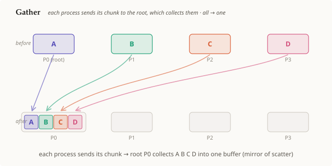

# 게더

## 요약

**게더(gather)**는 모든 프로세스가 자신의 청크(chunk)를 [[root-process]]에게
보내고, 루트가 그것들을 하나의 버퍼로 **수집**하는 [[collective-operation]]이다. 이는
스캐터(scatter)의 정확한 **역연산**이다. 스캐터가 루트로부터 서로 다른 청크를
*밖으로* 나눠주는 반면, 게더는 서로 다른 청크를 루트 *안으로* 끌어모은다. 형태는
**전체 → 하나**이며, 스캐터와 마찬가지로 데이터를 옮길 뿐 아무것도 결합하지 않는다.

## 상세 설명

게더는 [[root-process]] 방향으로 비대칭이지만, 스캐터와는 반대 방향이다. 여기서
루트는 **원천(source)**이 아니라 **싱크(sink)**다.

1. **시작 상태.** 각 랭크는 자신의 청크를 가지고 있다. 그림에서는
   `P0=A, P1=B, P2=C, P3=D`다. 루트는 지금까지 자기 자신의 조각만 가지고 있다.
2. **연산.** 모든 랭크가 동일한 루트를 지정하여 게더를 호출한다. 각 프로세스는
   자신의 청크를 루트에게 *보내고*, 루트는 그것들을 모두 *받아서* **랭크 순서대로**
   배치한다. 랭크 `i`에서 온 청크는 결과 버퍼의 슬롯 `i`로 간다. 그 순서 규칙 덕분에
   수집된 `A B C D`가 의미를 가지며 뒤섞이지 않는다.
3. **종료 상태.** 오직 루트만이 조립된 버퍼(`P0 = A B C D`)를 갖는다. 다른 랭크들은
   변하지 않는다. 조각들은 *수집*된 것이지, 복사되거나 합산된 것이 아니다.

[[collective-operation]]으로서 이는 루트로 수렴하는 점대점(point-to-point)
전송이며, 출처마다 하나씩이다. 이 계열의 구분을 기억해두자. **스캐터**는 루트가
청크를 *밖으로* 나눠준다(하나 → 전체). **게더**는 루트가 청크를 *안으로*
모은다(전체 → 하나). 만약 루트가 청크들을 *수집*하는 대신 *결합*해서 하나의 값으로
만든다면, 그것이 바로 **리듀스**다.

## 선행 개념

- [[collective-operation]]
- [[root-process]]

## 출처

_없음_
