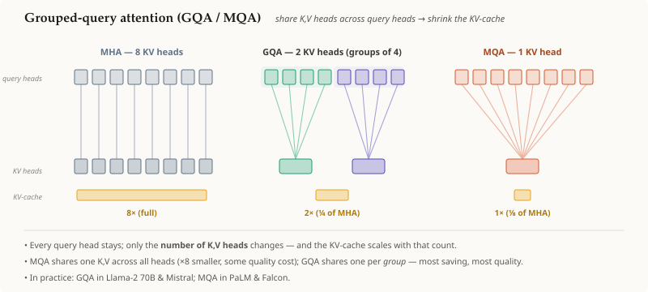

# 그룹 쿼리 어텐션 (GQA / MQA)

## 요약

표준 [[multi-head-attention]]은 모든 query 헤드에게 각자의 **고유한** key/value
헤드를 준다 — 그래서 [[kv-cache]]는 헤드마다 하나씩 `K,V`를 저장한다. 이 캐시가
바로 추론(inference)의 병목이기 때문에, **멀티 쿼리 어텐션(multi-query
attention, MQA)**은 *모든* query 헤드가 **하나**의 `K,V` 헤드를 공유하게 하고,
**그룹 쿼리 어텐션(grouped-query attention, GQA)**은 그 중간 지점이다: query
헤드들을 몇 개의 **그룹**으로 나누고, 각 그룹이 하나의 `K,V` 헤드를 공유한다.
`K,V` 헤드가 줄어들면 → 그에 비례해 **KV 캐시가 작아지고**(스텝당 메모리
트래픽도 줄어든다) 품질 손실은 거의 없다.

## 상세 설명

헤드가 $h$개인 [[transformer-attention]]에서 각 헤드 $i$는 자신만의
$Q_i, K_i, V_i$를 갖는다. 디코딩 중에는 [[kv-cache]]가 **모든 헤드**의,
**지나온 모든 토큰**에 대한 `K`와 `V`를 저장해야 하므로, 그 크기는
**KV 헤드**의 수에 비례해 커진다:

$$\text{cache} \;\propto\; 2 \times n_\text{tokens} \times n_\text{layers} \times \underbrace{n_\text{kv-heads}}_{\text{조절 손잡이}} \times d_\text{head}.$$

query 헤드는 많이 유지해도 저렴하다(캐시에 남지 않기 때문이다). 캐시 메모리
비용을 지배하는 것은 **KV 헤드**다. 그러므로 이 둘의 개수를 분리한다:

1. **MHA (기준선).** $n_\text{kv-heads} = h$. $h$개의 query 헤드 각각이 자신의
   `K,V`를 갖는다. 캐시도 전체, 품질도 전체.
2. **MQA.** $n_\text{kv-heads} = 1$. $h$개의 query 헤드 전부가 **하나**의
   공유 `K,V` 헤드에 어텐션한다 — 캐시가 $h$배만큼 줄어든다. 가장 저렴하지만,
   단일 공유 헤드가 품질을 떨어뜨리거나 학습을 불안정하게 만들 수 있다.
3. **GQA.** $1 < g < h$인 $n_\text{kv-heads} = g$. $h$개의 query 헤드를 $g$개의
   그룹으로 나누고, 한 그룹 안의 모든 헤드가 그 그룹의 `K,V`를 공유한다. 캐시는
   $h/g$배만큼 줄어든다 — MQA의 절감 효과 대부분을 유지하면서 MHA의 품질도
   많이 유지한다. (Llama-2 70B와 Mistral은 GQA를, PaLM과 Falcon은 MQA를
   사용한다.)

즉 GQA/MQA는 어텐션의 표현력을 약간 희생해서 추론 비용을 지배하는 요인을 크게
줄이는 거래를 하는 것이며, 이는 곧 그것들의 존재 이유인 [[kv-cache]] 크기를
직접 공략하는 것이다.

## 선행 지식

- [[transformer-attention]]
- [[kv-cache]]

## 출처

_없음_
