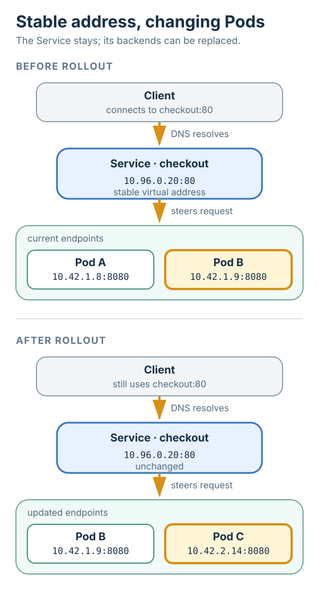

# Kubernetes Service

## Summary

A **Kubernetes Service** gives a changing set of backend [[kubernetes-pod|Pods]] one stable network
identity. Clients use the Service's name and address instead of any Pod address. Kubernetes
continuously records which Pods currently belong to the Service, and the cluster's traffic mechanism
applies [[load-balancing]] to steer each connection to one of those backends. Pods may appear,
disappear, or receive new addresses while the client-facing identity remains unchanged.

## Grounded explanation

### The problem: Pod identity is deliberately temporary

A [[kubernetes-pod]] has its own network address, but a replacement Pod is a new object and normally
gets a new address. If a client stored the addresses of three replicas itself, every rollout, crash,
or scaling event would make that list stale. The client needs a durable answer to “where is the
checkout application?” even though the concrete answers to “which Pods implement it now?” keep
changing.

A Service separates those two questions. The **Service identity** is the stable name and, for a
normal Service, a stable virtual cluster address. The **backend membership** is the changing set of
network endpoints that currently implement it. This is the key abstraction: continuity belongs to
the Service, while replaceability belongs to the Pods.

### How membership stays current

A Service definition commonly contains a **selector**, a rule that matches labels attached to Pods.
For example, `app=checkout` means “the Pods whose `app` label has the value `checkout`.” A Kubernetes
controller watches the Service and Pods, computes the matching ready endpoints, and records them in
**EndpointSlice** objects. An EndpointSlice is simply a partition of the Service's current backend
addresses and ports; partitioning keeps the representation manageable when the set is large.

Separately, a service-proxy implementation watches the Service and its EndpointSlices and programs
the cluster's traffic path. When packets target the Service's virtual address and port, that data
plane selects one current endpoint and redirects the connection to it. This is [[load-balancing]]:
one stable front endpoint maps work onto one eligible member of a changing backend pool. The control
plane maintains the pool; the data plane carries the traffic.

### Worked instance: one request while the replicas change

Suppose a Service named `checkout` selects `app=checkout`, exposes port `80`, and forwards to backend
port `8080`. Its stable cluster address is `10.96.0.20`. At first, its EndpointSlice contains two
ready Pods:

| Pod | Label | Endpoint |
|---|---|---|
| `checkout-a` | `app=checkout` | `10.42.1.8:8080` |
| `checkout-b` | `app=checkout` | `10.42.1.9:8080` |

A client resolves the Service name through [[dns]] and connects to `10.96.0.20:80`. The traffic
mechanism chooses `checkout-b` and redirects that connection to `10.42.1.9:8080`.

During a rollout, `checkout-a` disappears and a replacement `checkout-c` becomes ready at
`10.42.2.14:8080`. The controller updates the EndpointSlice to contain `checkout-b` and
`checkout-c`; the service proxy updates its traffic rules. The next client still resolves the same
name and connects to the same Service address. Only the hidden backend choice changes. No client
needs to watch Pods or rewrite a destination.

### Service types change reachability, not the core abstraction

The default **ClusterIP** type gives the Service an address reachable inside the cluster. **NodePort**
also opens a port on each cluster machine. **LoadBalancer** asks an integrated infrastructure
provider for an external balancer that leads into the Service. **ExternalName** returns another DNS
name rather than proxying traffic. These types change how the stable identity is exposed; the usual
Service still exists to decouple clients from a changing backend set.

A **headless Service** deliberately omits the virtual address and platform load balancing. Its
[[dns]] records reveal the backend addresses directly, allowing the client to choose among them. That
exception makes the normal Service's contribution especially clear: stable discovery plus managed
traffic steering, not merely a list of Pods.

## Prerequisites

- [[kubernetes-pod]]
- [[load-balancing]]
- [[dns]]

## Sources

- [Kubernetes documentation — Service](https://kubernetes.io/docs/concepts/services-networking/service/)
- [Kubernetes documentation — Virtual IPs and Service Proxies](https://kubernetes.io/docs/reference/networking/virtual-ips/)
