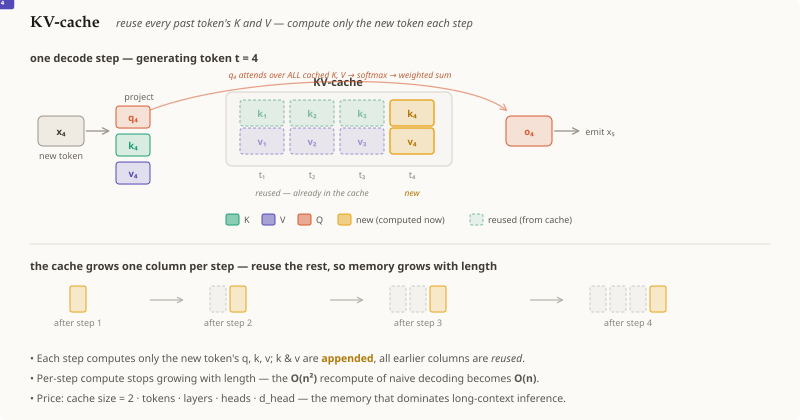

# KV-cache

## Summary

When a transformer **generates text one token at a time**, every step's
[[transformer-attention]] needs the **keys and values of all earlier tokens**.
Those don't change once computed, so recomputing them each step is pure waste.
The **KV-cache** stores each token's `K` and `V` the first time they're produced
and **reuses** them forever after — so each new step only computes **one** new
token's query, key, and value, appends that `K`/`V` to the cache, and attends
against the whole cache. It trades **memory** (the cache grows with the sequence)
for a huge drop in repeated compute.

## Grounded explanation

Recall [[transformer-attention]]:
$\mathrm{Attention}(Q,K,V) = \mathrm{softmax}(\tfrac{QK^{\top}}{\sqrt{d_k}})\,V$.
In **autoregressive decoding** the model has already emitted tokens $1..t-1$ and
now produces token $t$. The key facts:

1. **Only the new query matters.** The output for step $t$ is just the *new* row,
   $o_t = \mathrm{softmax}(\tfrac{q_t K_{1:t}^{\top}}{\sqrt{d_k}})\,V_{1:t}$ — a
   single query $q_t$ attending over **all** keys/values so far. Earlier output
   rows are already emitted and never recomputed.
2. **The past is frozen.** Because attention is **causal** (token $t$ only sees
   $1..t$), the keys $K_{1:t-1}$ and values $V_{1:t-1}$ computed at earlier steps
   are **identical** at step $t$. There is no reason to recompute them.
3. **So cache them.** Keep two growing buffers, the **K-cache** and **V-cache**.
   At step $t$: project the one new token into $q_t, k_t, v_t$; **append** $k_t$
   to the K-cache and $v_t$ to the V-cache (one new column); then run the attention
   above against the now-$t$ cached columns.

This turns the per-step cost from *recomputing $t$ tokens'* `K`/`V` into computing
**one** — generation over a length-$n$ sequence drops from $O(n^2)$ repeated
projection work to $O(n)$. The price is memory: the cache holds
$2 \times n_\text{tokens} \times n_\text{layers} \times n_\text{heads} \times d_\text{head}$
values, which for long context or large batch becomes the **dominant** inference
cost — the pressure that later motivates fewer KV heads (GQA/MQA), paged cache
memory, and KV-quantization.

## Prerequisites

- [[transformer-attention]]

## Sources

_none_
