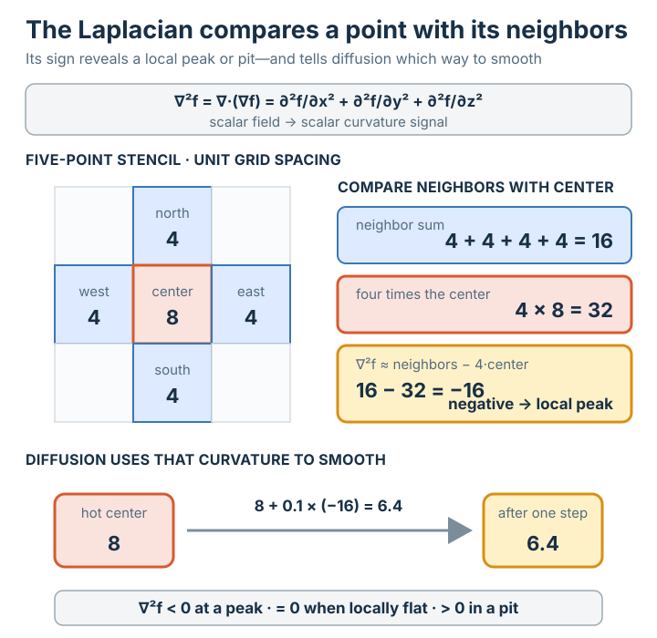

# 라플라시안 (∇²f)

## 요약

**라플라시안**은 그래디언트의 발산이다 — 즉 2차 편미분들의 합이다. 입력: 스칼라 →
출력: 스칼라.

## 상세 설명

$f$의 [[gradient]]를 취한 다음, 그 [[divergence]]를 취한다:

$$\nabla^2 f = \nabla \cdot (\nabla f) = \frac{\partial^2 f}{\partial x^2} + \frac{\partial^2 f}{\partial y^2} + \frac{\partial^2 f}{\partial z^2}$$

동등하게 $\nabla \cdot \nabla$ — "델과 델의 내적"이다. 이는 한 점의 값이 이웃들의
평균과 얼마나 다른지를 측정하는데, 이것이 바로 확산, 열 흐름, 평활화를 지배하는
이유다.

## Prerequisites

- [[divergence]]
- [[gradient]]

## 그림

## Sources

- etc/differential-operators-summary.html
