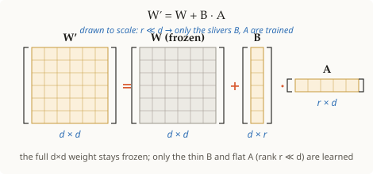

# LoRA (저랭크 적응)

## 요약

LoRA(Low-Rank Adaptation, 저랭크 적응)는 원래의 가중치 행렬 `W`를 *고정*하고
작은 저랭크(low-rank) 업데이트 `ΔW = B·A`만 학습함으로써 대규모 사전학습
모델을 새로운 작업에 적응시킨다. 추론 시에는 모델이 `W + B·A`를 사용한다.
`B`와 `A`만 학습되므로 학습 가능한 파라미터 수가 수 차수(order of magnitude)만큼
줄어든다.

## 상세 설명

이 아이디어 전체는 [[low-rank-factorization]]에 기반한다: `W`의 `d²`개
항목 전부를 갱신하는 대신, LoRA는 모델을 적응시키는 데 필요한 *변화* 자체가
저랭크라고 가정하고, `ΔW`를 아주 작은 `r`로 `B·A`로 표현한다. 학습은
`W`를 고정한 채 `2dr`개의 파라미터만 건드린다.

이 가중치 행렬들이 모델 안 어디에 있는지는 이제 [[transformer-attention]]으로
근거가 마련된다 — LoRA는 저랭크 업데이트를 query와 value 투영($W_q$, $W_v$)에
주입한다. *무엇이* 적응되는지 — [[fine-tuning]] — 가 LoRA의 선행 지식 중
아직 프런티어에 남아 있는 유일한 것이다.

## 선행 지식

- [[low-rank-factorization]]
- [[fine-tuning]]
- [[transformer-attention]]

## 시각 자료

**1 · 기호** — 🟦 스칼라 · 🟩 벡터 · 🟧 행렬

| 기호 | 유형 | 형태 | 의미 |
|--------|------|-------|---------|
| $W$ | 🟧 행렬 | $d\times d$ | 고정된 사전학습 가중치 (학습되지 않음) |
| $\Delta W$ | 🟧 행렬 | $d\times d$ | 학습된 업데이트, 저랭크로 강제됨 |
| $B$ | 🟧 행렬 | $d\times r$ | 학습 가능한 인자, $0$으로 초기화 |
| $A$ | 🟧 행렬 | $r\times d$ | 학습 가능한 인자, 무작위로 초기화 |
| $x$ | 🟩 벡터 | $d$ | 입력 활성값 |
| $h$ | 🟩 벡터 | $d$ | 출력 활성값 |
| $r$ | 🟦 스칼라 | — | 업데이트의 랭크; $r \ll d$ |
| $\alpha$ | 🟦 스칼라 | — | 스케일링 상수 (업데이트는 $\alpha/r$만큼 스케일됨) |
| $d$ | 🟦 스칼라 | — | 모델 차원 |

**2 · 방정식**

$$\Delta W = B\,A \qquad \text{(업데이트는 저랭크다)}$$

$$h = W x + \tfrac{\alpha}{r}\,B\,A\,x \qquad \text{(순전파 — } B,\,A \text{만 학습된다)}$$

**3 · 형태**

학습 가능한 파라미터: $d^2$가 아니라 $2dr$($B$와 $A$뿐) — $W$는 결코
움직이지 않는다. 추론 시에는 $B\,A$가 $W$에 다시 접혀 들어가므로, LoRA는
지연 시간을 **전혀** 추가하지 않는다.

## 출처

- arxiv:2106.09685
