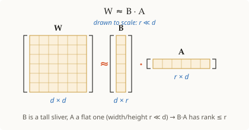

# Low-rank factorization

## Summary

Approximating a large matrix `W` (`d×d`) by the product of two thin matrices
`B` (`d×r`) and `A` (`r×d`) with `r ≪ d`. The product `B·A` is forced to have
rank at most `r`, so it captures `W`'s dominant directions with far fewer
numbers: `2dr` instead of `d²`.

## Grounded explanation

By [[matrix-rank]], a product like `B·A` cannot have more independent directions
than its thinnest dimension `r`, so choosing a small `r` deliberately constrains
the result to *low rank*. We accept some error in exchange for storing `2dr`
parameters instead of `d²` — a big saving when `d` is large and the important
structure of `W` lives in only a few directions.

## Prerequisites

- [[matrix-rank]]

## Visual

**1 · Symbols** — 🟦 scalar · 🟩 vector · 🟧 matrix

| Symbol | Type | Shape | Meaning |
|--------|------|-------|---------|
| $W$ | 🟧 matrix | $d\times d$ | original dense matrix being approximated |
| $B$ | 🟧 matrix | $d\times r$ | left factor (tall, narrow) |
| $A$ | 🟧 matrix | $r\times d$ | right factor (wide, short) |
| $r$ | 🟦 scalar | — | rank kept; $r \ll d$ |
| $d$ | 🟦 scalar | — | full dimension |

**2 · Equation**

$$W \;\approx\; B\,A, \qquad (d\times d) \approx (d\times r)(r\times d), \quad r \ll d$$

**3 · Shape**

Storage: $W$ needs $d^2$ numbers; $B\,A$ needs $2dr$ (since $r \ll d$) — e.g.
$d = 4096,\ r = 8 \Rightarrow 2 \cdot 4096 \cdot 8 / 4096^2 \approx 0.4\%$ of the
original size.

## Sources

_none_
