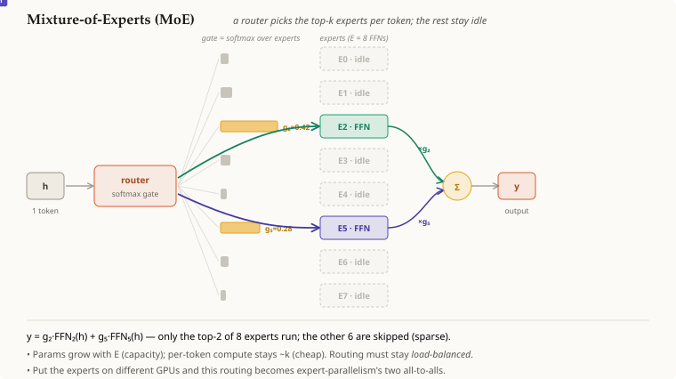

# 전문가 혼합 (Mixture-of-Experts, MoE)

## 요약

**전문가 혼합(Mixture-of-Experts, MoE)** 레이어는 트랜스포머의 *단일* 피드포워드
블록을 **여러 개**의 블록으로 대체한다 — 각각은 독립적인 가중치를 가진 작은
`[[neural-network]]` FFN이며, 이를 **전문가(expert)**라고 부른다 — 그리고 매 토큰마다
**상위 k개**의 전문가만 실제로 실행하도록 고르는 **라우터(router)**가 추가된다. 이는
전체 파라미터 수와 토큰당 연산량을 **분리**한다: 수백 개의 전문가를 쌓아 (거대한
용량) 각 토큰은 여전히 그중 $k$개만 통과하게 만든다 (작고 고정된 연산량). 그
대가는 라우팅 결정과 전문가 부하의 불균형이다.

## 상세 설명

일반적인 트랜스포머 레이어는 **모든** 토큰을 **하나의** FFN — 즉 `[[neural-network]]`
블록 — 으로 보낸다. MoE는 이 블록을 $E$개의 전문가로 이루어진 집단
$\{\text{FFN}_1, …, \text{FFN}_E\}$으로 바꾼다. 각 전문가는 독립적인 가중치를 가지며,
라우터에 의해 게이팅된다:

1. **라우팅 (게이트).** 작은 선형 레이어가 토큰의 은닉 벡터 $h$를 각 전문가와
   대조하여 점수를 매기고, [[softmax]]로 정규화한다:
   $g = \mathrm{softmax}(W_r\,h) \in \mathbb{R}^{E}$ — 전문가들에 대한 확률
   분포다.
2. **상위 k개 선택 (희소성).** 가장 큰 $k$개의 게이트 값만 남긴다 (보통 $k=1$
   또는 $2$); 나머지 $E-k$개의 전문가는 이 토큰에 대해 **실행되지 않는다**.
   따라서 연산량은 $k$(상수)에 비례해 늘어나는 반면, 파라미터 수는 $E$에 비례해
   자유롭게 늘어난다. 이것이 핵심이다: 용량이 연산량을 압도한다.
3. **계산 + 결합.** 토큰을 선택된 전문가들에 통과시키고, 그 출력을 게이트
   가중합으로 결합한다:
   $y = \sum_{i \in \text{top-}k} g_i \, \text{FFN}_i(h).$
   게이트 값은 혼합 가중치 역할도 겸하므로, 라우터는 종단간(end-to-end)으로
   학습된다.

이런 라우팅 방식 때문에 각 FFN은 학습 과정에서 **전문화**하는 경향을 보이며
(서로 다른 전문가가 서로 다른 종류의 토큰을 처리한다) 이것이 **전문가**라는
이름의 유래다 — 역할이 미리 배정되는 것이 아니라 자연스럽게 생겨난다. 가장 큰
어려움은 **부하 균형(load balance)**이다: 라우터가 소수의 인기 전문가로
쏠릴 수 있으므로, 보조 균형 손실(auxiliary balancing loss)이 트래픽을 고르게
퍼뜨리도록 유도한다.

밀집(dense) FFN과 전문가 하나는 *같은* 종류의 블록이다 — MoE는 단지 *여러 개*와
게이트를 추가할 뿐이다. 그리고 전문가가 여러 개가 되면 이들을 서로 다른 GPU에
배치할 수 있는데, 이것이 전문가 병렬화(expert-parallelism)이며 위의 라우팅은
두 번의 `all-to-all` 통신이 된다.

## 전제 조건

- [[neural-network]]
- [[softmax]]

## 출처

_없음_
