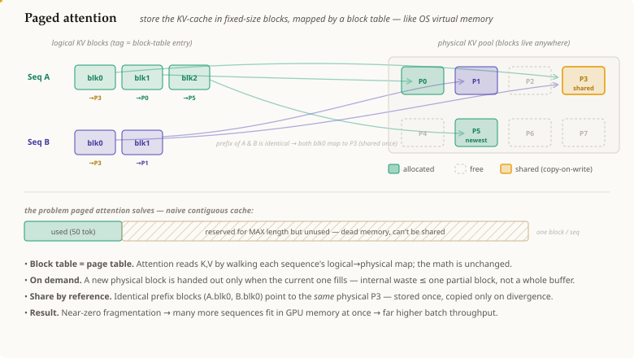

# 페이지드 어텐션 (Paged Attention)

## 요약

[[kv-cache]]는 한 번에 토큰 하나씩 자라지만, 시퀀스의 *최종* 길이는
알 수 없으므로, 순진한 구현은 **최대** 길이에 맞춘 **하나의 큰 연속
블록**을 예약해둔다 — 그 대부분을 낭비하고 (내부 단편화, internal
fragmentation) 공유를 막는다. **페이지드 어텐션(paged attention)**
(vLLM 뒤에 있는 아이디어)은 **[[virtual-memory|운영체제의 가상
메모리]]**를 빌려온다: 캐시를 작은 **고정 크기 블록**("페이지", 예를
들어 각각 16개 토큰)으로 잘게 나누고, 시퀀스가 자랄 때마다 **필요한
만큼(on demand)** 이를 할당하며, 논리적 토큰 위치 → 물리적 블록을
매핑하는 시퀀스별 **블록 테이블(block table)**을 유지한다. 메모리는
더 이상 연속적일 필요가 없고, 단편화는 거의 사라지며, 블록은 여러
시퀀스에 걸쳐 **공유**될 수 있다 — 이는 한 배치에서 훨씬 더 많은
요청을 실행할 수 있게 해준다.

## 상세 설명

[[kv-cache]]를 상기하자: 매 스텝마다 토큰 하나의 `K,V`가 덧붙여지므로,
시퀀스의 캐시는 계속 자란다. 문제는 그것을 *어디에* 둘 것인가이다.
단순한 선택 — 모델의 최대 컨텍스트에 맞춰 미리 크기를 정한, 시퀀스당
하나의 연속 버퍼 — 에는 세 가지 비용이 있다:

1. **내부 단편화.** 50개 토큰 만에 끝나는 요청도 예를 들어 2048개용
   버퍼를 여전히 붙들고 있다 — 사용되지 않는 꼬리 부분은 다른 어떤
   요청도 쓸 수 없는 죽은 메모리다.
2. **공유 불가.** **같은 프롬프트 접두사(prompt prefix)**를 가진 두
   요청 (또는 한 요청의 빔 서치 분기들)은 그 접두사의 `K,V`가
   동일함에도 각자 완전한 개인 사본을 유지한다.
3. **동시 요청 수 감소.** 각 시퀀스가 최악의 경우를 대비한 버퍼를
   독차지하기 때문에, 연산 능력이 다하기 훨씬 전에 GPU 메모리가
   바닥나 배치 크기와 처리량에 상한이 걸린다.

페이지드 어텐션은 OS 페이징 트릭으로 이 세 가지를 모두 해결한다:

- **고정 크기 블록.** [[kv-cache]]는 각각 몇 개 토큰의 `K,V`를 담는
  균일한 블록들로 나뉜다. 물리적 블록들은 공유 풀 안 어디든 존재할
  수 있다 — 연속적일 필요가 없다.
- **블록 테이블 ([[page-table]]).** 각 시퀀스는 작은 테이블을 유지한다:
  논리 블록 *i* → 물리 블록 주소. 어텐션은 이 테이블을 훑으며 `K,V`를
  읽으므로 수학 자체는 변하지 않는다; 오직 *조회(lookup)*만 간접화될
  뿐이다.
- **필요할 때 할당.** 새 블록은 현재 블록이 다 찼을 때만 배정되므로,
  시퀀스는 자신의 실제 길이 만큼만 사용한다 — 내부 낭비는 많아야
  부분적으로 채워진 블록 하나로 줄어든다.
- **참조로 공유.** 동일한 접두사 블록은 **여러** 블록 테이블에서
  가리켜진다 (하나가 갈라질 때는 [[copy-on-write]]), 그래서 공유된
  프롬프트는 **한 번만** 저장된다.

결과는 이렇다: 같은 GPU가 한 번에 훨씬 더 많은 시퀀스의 캐시를
보유하게 되어, 배치 크기와 처리량이 크게 상승한다 — 페이지드
어텐션은 [[kv-cache]] 병목의 **메모리** 측면을 공략하는데, 이는 더
적은 KV 헤드를 쓰도록 동기를 부여하는 것과 같은 압박이다.

## 전제 조건

- [[kv-cache]]
- [[virtual-memory]]
- [[page-table]]
- [[copy-on-write]]

## 출처

_없음_
