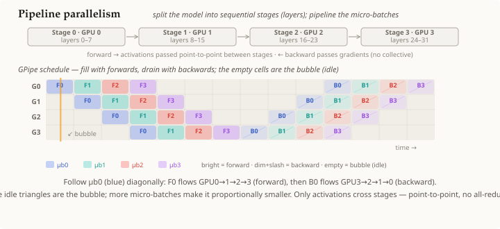

# Pipeline parallelism

## Summary

**Pipeline parallelism** splits a [[neural-network]] by **layers** — each GPU holds a
contiguous block of layers (a *stage*) — and pushes the data through the stages like an
assembly line. To keep every stage busy, the batch is cut into **micro-batches** that
flow through the pipeline one after another. Stages exchange only **activations**
(forward) and **gradients** (backward), passed **point-to-point** via [[message-passing]]
— there is **no collective** at all. The unavoidable idle time while the pipeline fills
and drains is the **bubble**.

## Grounded explanation

Where data parallelism replicates the model and tensor parallelism shards each weight,
pipeline parallelism splits the model **depth-wise**:

1. **Layers → stages.** Cut the [[neural-network]]'s layers into `P` contiguous blocks,
   one per GPU. Forward activations flow `stage 0 → 1 → 2 → 3`; the backward pass sends
   [[gradient]]s the other way, `3 → 2 → 1 → 0` (chain rule).
2. **The dependency problem.** Stage `i+1` cannot start until stage `i` has produced its
   activations. Run a single batch and only **one** GPU is busy at a time — the rest
   idle. That defeats the point.
3. **Micro-batches fill the pipe.** Split the batch into `M` micro-batches. As soon as
   stage 0 finishes micro-batch 0 it hands the activations to stage 1 (a point-to-point
   [[message-passing]] send) and immediately starts micro-batch 1. Now every stage works
   on a *different* micro-batch at once — the diagonal cascade in the figure (follow one
   colour through `G0→G1→G2→G3`).
4. **The bubble.** At the start (fill) and end (drain) some stages have nothing to do —
   the empty triangles in the schedule. That idle fraction is roughly `(P-1)/(M+P-1)`,
   so **more micro-batches → proportionally smaller bubble** and higher utilization.
5. **Communication is point-to-point, not collective.** Only activations and gradients
   cross stage boundaries, each a single [[message-passing]] send to the *next* stage —
   never an all-reduce over the whole group. That makes the bandwidth need tiny, so
   pipeline parallelism works even across nodes on slow links.

The contrast across the three strategies is the communication pattern: **data
parallelism** all-reduces *gradients* once per step; **tensor parallelism** all-reduces
*activations* once per layer; **pipeline parallelism** sends *activations forward* and
*gradients backward* point-to-point between adjacent stages, with no collective. It is what lets a model too deep for one GPU
be trained at all — at the cost of the bubble and of storing in-flight activations.

## Prerequisites

- [[neural-network]]
- [[message-passing]]
- [[gradient]]

## Sources

_none_
