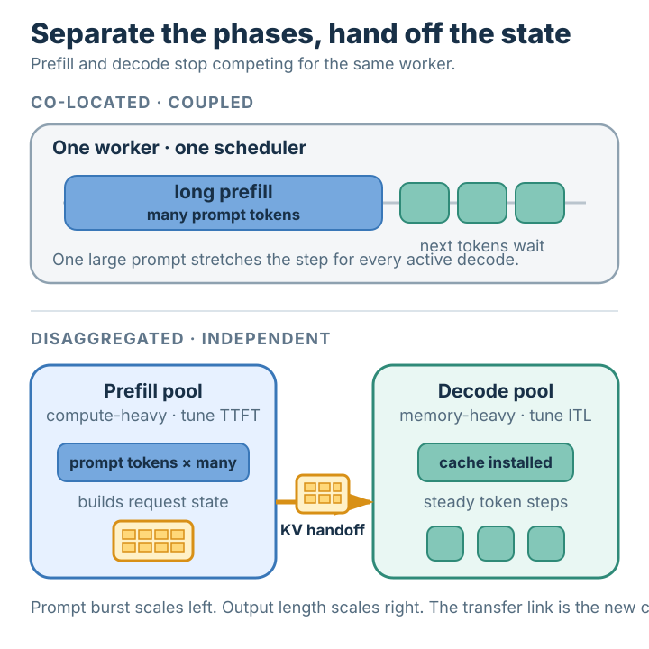

# Prefill-Decode Disaggregation

## Summary

**Prefill-decode disaggregation** runs the two phases of an LLM request on separate worker pools.
A prefill worker processes the prompt and builds its [[kv-cache]]; that cache is then transferred to
a decode worker, which generates the output tokens. The split follows the opposite hardware profiles
described by [[prefill-vs-decode]]: prefill wants abundant compute, while decode wants memory bandwidth,
capacity, and stable per-token scheduling. Separating them prevents a long prompt from delaying
ongoing generation and lets each pool be scaled for its own latency target. The price is a new boundary:
the KV cache must move quickly enough that transfer time does not erase the benefit.

## Grounded explanation

### One worker mixes two incompatible workloads

In a conventional serving worker, every request enters the same scheduler. A new request first runs
prefill; after its prompt has been processed, the same worker repeatedly runs decode steps. But
[[prefill-vs-decode]] shows that these are not two similar jobs. Prefill applies the model to many
prompt tokens in parallel and tends to consume arithmetic throughput. Decode advances each active
sequence by one token and repeatedly reads model state, so it tends to consume memory bandwidth.

Co-location couples their fates. A large prefill admitted beside active decodes can lengthen that
scheduler step, delaying every user's next streamed token. Provisioning is coupled too: adding the
compute capacity needed for prompt bursts also adds decode capacity whether decode needs it or not.
One pool must compromise between time to first token and time between later tokens.

### Split at the state boundary

Disaggregation turns the phase boundary into a handoff:

1. A router assigns the request to a **prefill worker**. That worker processes all prompt tokens,
   produces the first-token state, and fills the request's [[kv-cache]].
2. A coordinator chooses a **decode worker** and transfers the cache, the next-token input, and small
   request metadata to it.
3. The decode worker installs that cache and continues the ordinary token-by-token loop. The client
   sees one response stream even though execution moved between workers.

Why is this handoff correct? Each decode step needs the model's weights, the newest token, and the
stored keys and values for all earlier tokens. The destination already has the same model; the
transferred [[kv-cache]] supplies the accumulated per-request state. With the same cache contents and
next-token input, decode resumes from the same logical point it would have reached on the prefill
worker. The system moves state, not partially completed model layers.

### Independent pools remove interference

The prefill pool can now batch prompt tokens aggressively and choose enough compute parallelism to
meet its first-token target. The decode pool can maintain steady, compact steps over many active
sequences and be sized for memory capacity and bandwidth. A prompt burst waits for prefill workers
instead of making already-streaming responses pause behind it.

The pools can also scale independently. If prompt arrivals rise while the number of active generated
sequences stays flat, the operator can add prefill workers without duplicating decode capacity. If
responses become longer, decode workers can grow without over-provisioning the prompt path. This is
the central payoff: phase-specific scheduling and resource allocation become separate control knobs.

Disaggregation does not create free throughput by itself. It trades interference and coupled
provisioning for routing, waiting, and state-transfer work. Whether total capacity improves depends
on workload shape, pool balance, and whether the transfer path stays off the critical bottleneck.

### The KV transfer is the design constraint

For a decoder-only model, an illustrative cache size can be computed from:

$$
\text{KV bytes}
= 2 \times L \times T \times H_{kv} \times D_h \times B
$$

Here `2` counts keys and values, $L$ is the number of layers, $T$ is the number of cached tokens,
$H_{kv}$ is the number of key/value heads, $D_h$ is each head's width, and $B$ is bytes per stored
element. Consider an illustrative shape with $L=32$, $T=4096$, $H_{kv}=8$, $D_h=128$, and $B=2$:

$$
2 \times 32 \times 4096 \times 8 \times 128 \times 2
= 536{,}870{,}912\ \text{bytes}
= 512\ \text{MiB}.
$$

If the end-to-end transfer path sustains $50$ GiB/s, moving that one request's state takes at least
$0.5 / 50 = 0.01$ seconds, or about **10 ms**, before waiting and coordination overhead. Longer
prompts grow the cache and transfer time linearly. A practical system therefore uses high-bandwidth
links, overlaps layer-by-layer cache movement with remaining prefill work when possible, and places
paired pools close enough that transfer does not dominate first-token latency.

### What is—and is not—being separated

The split is by **request phase**, not by token ownership or by consecutive model layers. Prefill
workers finish the prompt computation; decode workers own the subsequent generation loop. Both sides
normally host the model needed for their phase, while the per-request [[kv-cache]] crosses once at the
handoff. This makes prefill-decode disaggregation a serving-topology decision: isolate two resource
profiles, preserve the request by transferring its exact state, and accept the network boundary that
is introduced in return.

## Prerequisites

- [[prefill-vs-decode]]
- [[kv-cache]]

## Sources

- Zhong et al., [“DistServe: Disaggregating Prefill and Decoding for Goodput-optimized Large Language
  Model Serving”](https://arxiv.org/abs/2401.09670), OSDI 2024.
- Patel et al., [“Splitwise: Efficient Generative LLM Inference Using Phase
  Splitting”](https://arxiv.org/abs/2311.18677), ISCA 2024.
