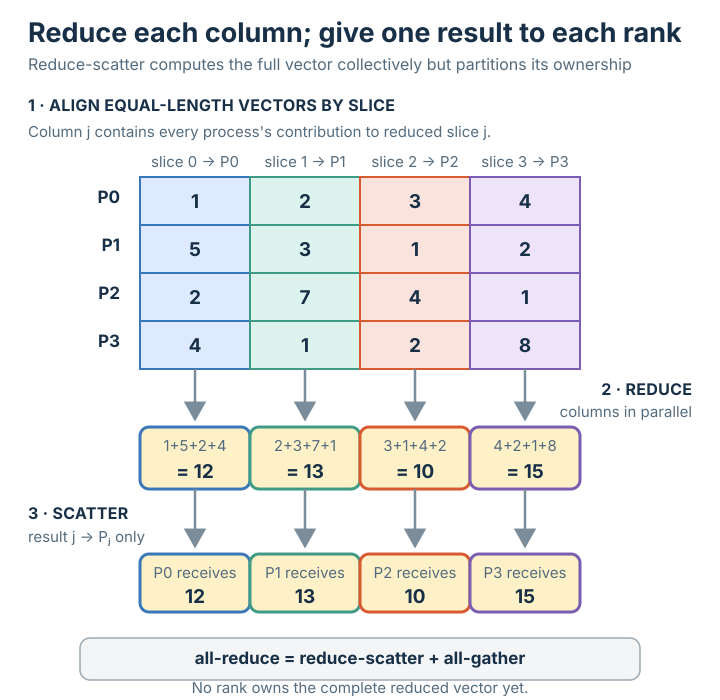

# Reduce-scatter

## Summary

**Reduce-scatter** is **[[reduce]] followed by [[scatter]]**: every process holds a
vector of the same length; the vectors are **reduced element-wise** (slice `j` of every
process is combined into one value), and then those reduced slices are **scattered** so
each process keeps **one** of them. Process `j` ends with the reduction of everyone's
`j`-th element. It computes *and* partitions — no single process ever holds the whole
reduced vector.

## Grounded explanation

Where [[reduce]] folds **scalars** to one scalar at a root, reduce-scatter folds
**vectors** and spreads the answer out:

1. **The reduce part — element-wise, per slice.** Line the processes' vectors up as a
   matrix (row = process, column = slice). For each column `j`, combine its values with
   the [[reduction-operation]], just like [[reduce]] but done once per column. In the figure
   column 0 gives `1+5+2+4 = 12`, column 1 `2+3+7+1 = 13`, and so on — each an amber
   *computed* result.
2. **The scatter part — one slice each.** Those reduced values form a vector
   `[12, 13, 10, 15]`. Instead of leaving it on one root, **scatter** it: slice `j` goes
   only to process `j` (`P0=12, P1=13, P2=10, P3=15`), exactly the one-chunk-per-process
   shape of [[scatter]].

The relationship to remember: **all-reduce = reduce-scatter + all-gather**.
All-reduce gives every process the *whole* reduced vector; reduce-scatter does only the
first half — it reduces, but then hands out just **one slice per process** instead of
broadcasting the full result. That is why fast all-reduce implementations are literally
built as a reduce-scatter followed by an all-gather: each phase moves only `1/n` of the
data per step.

## Prerequisites

- [[reduce]]
- [[scatter]]

## Sources

_none_
