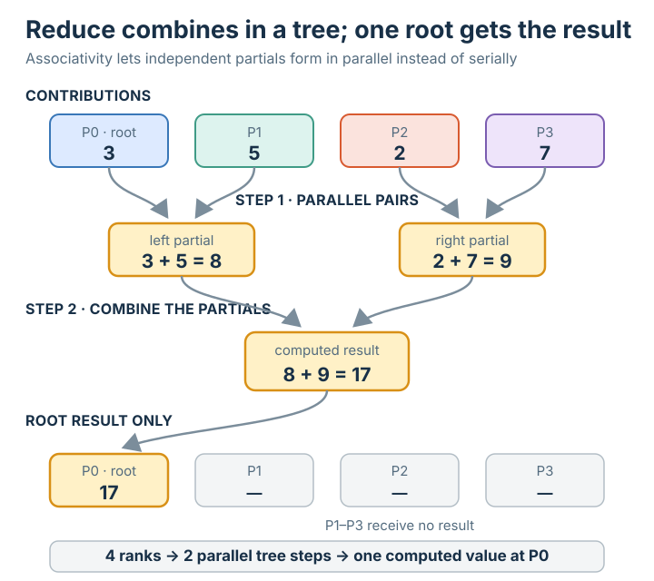

# Reduce

## Summary

**Reduce** is the [[collective-operation]] in which every process contributes a value
and they are all **combined by a [[reduction-operation]]** (e.g. SUM) into a **single
result** stored at the [[root-process]]. It has gather's **all → one** shape, but
where gather *collects* the pieces side by side, reduce **computes** — it folds them
into one value. It is the first collective in this branch that produces something new
rather than merely relocating data.

## Grounded explanation

Reduce is gather **with a combine step**:

1. **Start state.** Every rank holds one value — `3, 5, 2, 7` in the figure.
2. **The operation.** Every rank calls reduce naming the same root and the same
   [[reduction-operation]] `⊕`. The values flow toward the root and are folded
   together with `⊕`: `3 + 5 + 2 + 7 = 17`. Because `⊕` is associative, the partial
   combines can be arranged as a tree across the processes — so this costs about
   `log n` steps, not `n`.
3. **End state.** Only the root holds the **single combined result** (`P0 = 17`); the
   other ranks are unchanged. In the figure that result is drawn in **amber** — the
   protocol's mark for a value that was *computed*, not moved. (`17` is no longer any
   one process's data, so it gets a new colour rather than purple/teal/coral/pink.)

The contrast that fixes the idea: **gather** brings the four values to the root and
keeps them as `[3, 5, 2, 7]`; **reduce** brings them to the root and returns `17`. The
difference is entirely the [[reduction-operation]]. (And if *every* process — not just
the root — needed the `17`, that would be **all-reduce**.)

## Prerequisites

- [[collective-operation]]
- [[root-process]]
- [[reduction-operation]]

## Sources

_none_
