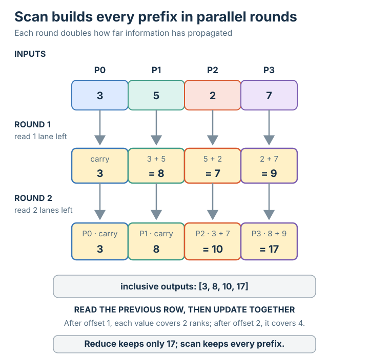

# Scan (prefix)

## Summary

**Scan** (inclusive prefix scan) is the [[collective-operation]] in which every process
contributes a value and process `i` receives the **[[reduction-operation]] of values
`0 … i`** — a **running total**. Where reduce produces one final answer, scan produces
*every partial answer along the way*: each rank gets the reduction of all ranks up to and
including itself.

## Grounded explanation

Scan is a [[reduction-operation]] applied **cumulatively** rather than all-at-once:

1. **Start state.** Each rank holds one value — `3, 5, 2, 7` in the figure.
2. **The operation.** Every rank calls scan with the same operation `⊕`. Rank `i`'s
   result is `v0 ⊕ v1 ⊕ … ⊕ vi` — the reduction of **only the ranks up to `i`**. The
   triangular fan in the figure shows this dependency: `P0` draws from `{0}`, `P1` from
   `{0,1}`, `P2` from `{0,1,2}`, `P3` from `{0,1,2,3}`.
3. **End state.** The results form a staircase of prefixes: `P0=3`, `P1=3+5=8`,
   `P2=3+5+2=10`, `P3=3+5+2+7=17`. Every rank holds a *different* value (unlike reduce,
   where only the root holds one). `P0`'s prefix is just its own input, so it is
   unchanged (drawn in its data colour); the rest are *computed*, so they are amber.

The clean contrast with reduce: reduce gives you **only the final total** (the `17`)
at one process; scan gives you **all the intermediate totals**, one per process — the
last of which equals reduce's answer. It relies on the same associativity of the
[[reduction-operation]], which also lets the prefixes be computed in parallel (a
prefix-sum tree) rather than strictly left to right.

## Prerequisites

- [[collective-operation]]
- [[reduction-operation]]

## Sources

_none_
