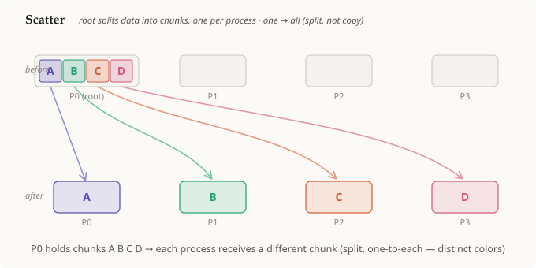

# 스캐터

## 요약

**스캐터(scatter)**는 [[root-process]]가 프로세스당 한 조각씩 나뉜 배열을
가지고 있고, 각 프로세스에게 **서로 다른** 조각을 보내는 [[collective-operation]]이다.
브로드캐스트와 마찬가지로 루트로부터의 **하나 → 전체** 모양을 가지지만,
브로드캐스트가 *동일한* 값을 모두에게 복사하는 것과 달리 스캐터는 **서로 다른
조각들을 나누어 분배**한다 — 프로세스 `i`는 조각 `i`를 받으며, 어떤 두 프로세스도
같은 데이터를 받지 않는다. 여전히 순수한 이동이며, 아무것도 계산되지 않는다.

## 상세 설명

스캐터는 브로드캐스트와 동일한 비대칭적 모양을 갖는다 — [[root-process]]가
유일한 원천이다 — 하지만 *누가 무엇을 받는지*는 다르다:

1. **시작 상태.** 오직 루트만 데이터를 가지고 있으며, 그 데이터는 논리적으로
   랭크당 하나씩인 `n`개 조각의 배열이다. 그림에서 P0은 `A B C D`(서로 다른
   네 개의 조각, 네 가지 색)를 가지고 있다.
2. **연산.** 모든 랭크가 동일한 루트를 지정하여 스캐터를 호출한다. 루트는
   조각 `0`을 (자신이 갖거나 받은 채로) 유지하고, 조각 `1`은 랭크 `1`에게,
   조각 `2`는 랭크 `2`에게 보내는 식으로 진행한다 — 즉 *i*번째 조각이 *i*번째
   랭크에게 간다. 조각 인덱스와 랭크가 일치한다는 점이 바로 이 분할을
   명확하게 정의해 준다.
3. **종료 상태.** 각 프로세스는 **자신만의, 서로 다른** 조각을 가진다 —
   `P0=A, P1=B, P2=C, P3=D`. (브로드캐스트의 단일 색과 대비되는) 서로 다른
   색들이 핵심이다: 데이터가 *복제*된 것이 아니라 *분할*되었다는 것이다.

이것은 [[collective-operation]]으로서, 루트로부터 각 목적지로 하나씩 부채꼴로
퍼지는 점대점 송신들로 이루어져 있다. 기억해 둘 대조는 다음과 같다:
**브로드캐스트는 하나의 값을 모두에게 복사하고, 스캐터는 서로 다른 조각을 각자에게
나누어 준다.** (그 거울상 — 각 프로세스가 자신의 조각을 루트로 되돌려 보내는
것 — 이 바로 *gather*다.)

## 전제 조건

- [[collective-operation]]
- [[root-process]]

## 출처

_none_
