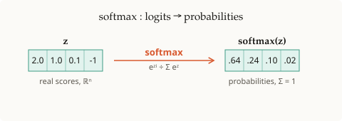

# Softmax

## Summary

**Softmax** turns a vector of real-valued scores (logits) into a probability
distribution — every entry positive and the whole thing summing to 1.

## Grounded explanation

Apply the always-positive [[exponential-function]] to each score, then normalize
by their sum ([[arithmetic]]):

$$\mathrm{softmax}(z)_i = \frac{e^{z_i}}{\sum_{j=1}^{n} e^{z_j}}$$

Exponentiation guarantees positivity and amplifies gaps between scores; dividing
by the total forces the outputs to sum to 1, making the output a valid
[[probability-distribution]] (every entry non-negative, all entries summing to
exactly 1). The largest logit gets the largest share — a smooth, differentiable
stand-in for "pick the maximum."

## Prerequisites

- [[exponential-function]]
- [[arithmetic]]
- [[probability-distribution]]

## Visual

**1 · Symbols** — 🟦 scalar · 🟩 vector · 🟧 matrix

| Symbol | Type | Shape | Meaning |
|--------|------|-------|---------|
| $z$ | 🟩 vector | $n$ | input logits (real scores) |
| $\mathrm{softmax}(z)$ | 🟩 vector | $n$ | output probabilities |
| $n$ | 🟦 scalar | — | number of classes / tokens |

**2 · Equation**

$$\mathrm{softmax}(z)_i = \frac{e^{z_i}}{\sum_{j=1}^{n} e^{z_j}}, \qquad \sum_{i=1}^{n}\mathrm{softmax}(z)_i = 1$$

**3 · Shape**

## Sources

_none_
