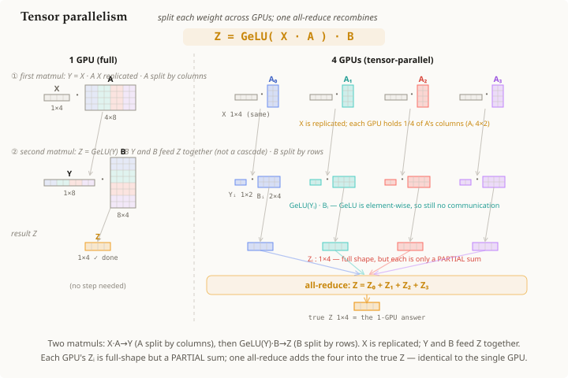

# Tensor parallelism

## Summary

**Tensor parallelism** splits a single layer's **weight matrices across GPUs** so that
one [[matrix-multiplication]] too big for one device is computed as several smaller
ones in parallel. Unlike data parallelism (which replicates the whole
[[neural-network]] and splits the *data*), tensor parallelism splits the *model* — each
GPU holds only a shard of each weight. The shards are chosen so the partial results can
be recombined with a single [[all-reduce]].

## Grounded explanation

Take an MLP block of a [[neural-network]], `Z = GeLU(X · A) · B`, where `X · A` and
`(…) · B` are [[matrix-multiplication]]s. The trick is *how* you shard the two weights:

1. **A is split by columns.** Give each GPU a vertical slice `Aᵢ` (e.g. 1/4 of A's
   output columns). Since `X` is replicated, GPU *i* computes `Yᵢ = X · Aᵢ` — a slice of
   the output dimensions. No communication is needed, and **GeLU is element-wise**, so
   `GeLU(Yᵢ)` is also local.
2. **B is split by rows** — matched to A's column split. GPU *i* holds the rows `Bᵢ` that
   line up with its columns of `Yᵢ`, and computes `Zᵢ = GeLU(Yᵢ) · Bᵢ`. By the rule of
   [[matrix-multiplication]] (sum over the shared dimension), each `Zᵢ` has the **full**
   output shape but is only a **partial sum** — it covers just *its* slice of the
   contracted dimension.
3. **One all-reduce finishes it.** The true result is `Z = Z₀ + Z₁ + Z₂ + Z₃`. Summing
   values held on different processes is exactly [[all-reduce]] (with SUM), after which
   every GPU holds the correct `Z`. The column-then-row split is deliberately chosen so
   that **only one** all-reduce per block is required.

So tensor parallelism trades memory for communication in the opposite way to data
parallelism. Data parallelism: replicate the model, split the **batch**, all-reduce the
**gradients** once per *step*. Tensor parallelism: split the **weights**, replicate the
**input**, all-reduce the **activations** once per *layer* (every forward pass). It's
what lets a layer whose weights don't fit on one GPU run at all — at the cost of frequent
communication, so it is normally confined to GPUs with fast interconnect within a node.

## Prerequisites

- [[matrix-multiplication]]
- [[neural-network]]
- [[all-reduce]]

## Sources

_none_
