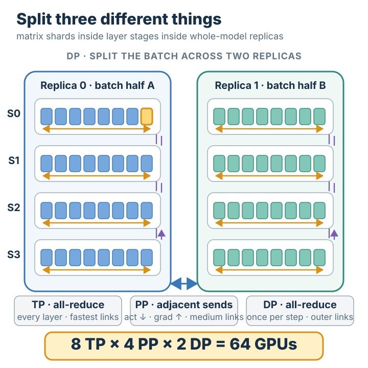

# 3D Parallelism

## Summary

**3D parallelism** trains a model too large for any single strategy by running all three
of [[tensor-parallelism]], [[pipeline-parallelism]], and [[data-parallelism]] **at the
same time**. The three are *orthogonal*: [[tensor-parallelism]] (TP) splits each layer's
weight matrices across a few GPUs; [[pipeline-parallelism]] (PP) splits the layer *stack*
into stages across GPUs; [[data-parallelism]] (DP) replicates that whole TP×PP group and
splits the *batch* across the replicas. Because they partition three different things —
within a layer, across layers, across samples — they **multiply**: the total GPU count is
`TP × PP × DP`. The art is **placement**: match each axis's communication intensity to
the hardware, putting the chattiest axis on the fastest links. This is the strategy behind
Megatron-LM and DeepSpeed.

## Grounded explanation

Each of the three prerequisite strategies hits its own wall when used alone. [[tensor-parallelism]]
shards a layer's weights but needs a collective on **every layer of every forward pass**, so it
saturates bandwidth past a handful of GPUs. [[pipeline-parallelism]] splits the depth but its
throughput is capped by the bubble and by how many stages you can usefully make.
[[data-parallelism]] scales the batch but requires the *whole* model to fit inside one replica.
3D parallelism's contribution is to use all three together so that each covers the others'
weakness — and to *place* them on the hardware so each axis's traffic lands on links fast enough
to carry it.

**The three axes are orthogonal — they partition different things.** This is the central
insight, and it is what lets them compose without interfering:

1. **TP partitions *within* a layer.** It cuts each weight matrix into shards (e.g. one
   layer's matrix split across 8 GPUs), as in [[tensor-parallelism]]. A group of GPUs
   cooperating on TP holds *one* copy of the layers, each GPU owning a slice of every
   matrix.
2. **PP partitions *across* layers.** It cuts the layer stack into contiguous stages, as in
   [[pipeline-parallelism]] — stage 0 holds the first block of layers, stage 1 the next, and
   so on. PP is layered *on top of* TP: each pipeline stage is not a single GPU but a whole
   TP group, so a stage's layers are themselves tensor-sharded.
3. **DP partitions *across* samples.** It takes the entire TP×PP structure — one full copy
   of the model, spread over `TP × PP` GPUs — and **replicates** it, then splits the data
   batch across the replicas, as in [[data-parallelism]].

Because no two axes split the same thing, the GPU counts multiply rather than overlap:
`total GPUs = TP × PP × DP`. A single GPU is identified by its coordinate on all three axes
at once — *which weight-shard* (TP), *which stage* (PP), *which replica* (DP).

**Why placement matters — match traffic to links.** The three prerequisites have very
different communication patterns, and that is exactly what decides where each axis goes:

- **TP is communication-heavy.** Per the [[tensor-parallelism]] node it does an [[all-reduce]]
  *every layer* (the source counts two per transformer block — one for the MLP, one for
  attention). That much collective traffic only stays cheap on the fastest interconnect, so
  TP is confined **within a single node**, over its high-bandwidth intra-node links (NVLink).
- **PP is communication-light.** Per the [[pipeline-parallelism]] node, stages exchange only
  activations and gradients, **point-to-point**, with no collective at all. The bandwidth
  need is tiny, so PP can stretch **across nodes** over a slower interconnect (even Ethernet).
- **DP sits outermost.** Per the [[data-parallelism]] node it does one gradient all-reduce
  *per step* — far less frequent than TP's per-layer collective — so it tolerates being
  spread across the slowest, longest links, between whole groups of nodes.

So the placement rule is: **TP innermost (within a node), PP in the middle (across nodes),
DP outermost (across groups of nodes)** — chattiest axis on the fastest links, sparsest axis
on the slowest. That ordering is the actual engineering content of 3D parallelism.

**A worked instance — 64 GPUs as TP=8 × PP=4 × DP=2.** Check the arithmetic first:
`8 × 4 × 2 = 64`. Now place them. Take TP=8 to be exactly one node of 8 GPUs joined by fast
intra-node links. Stack PP=4 such nodes into a 4-stage pipeline (`8 × 4 = 32` GPUs = one full
model copy, four nodes deep). Then DP=2 means *two* of those 32-GPU groups, with the training
batch split into two halves — one half fed to each group. Trace one training step by following
where each prerequisite's communication happens:

- **A single layer's matmul (TP).** Inside one node, the 8 GPUs each compute their shard of a
  layer (column-split, then row-split), and finish it with **one all-reduce among those 8
  GPUs** — entirely over the fast intra-node links. This fires for *every* layer the node owns.
- **A stage boundary (PP).** When a node finishes its block of layers for a micro-batch, it
  **sends the activations point-to-point to the next node** (stage 0 → 1 → 2 → 3), and on the
  backward pass sends gradients back the other way. No collective crosses the boundary — just a
  single message to the neighbouring stage, which is why this axis can live on slower inter-node
  links.
- **The gradient all-reduce (DP).** After both 32-GPU groups finish forward and backward on
  their half-batches, the **two replicas all-reduce their gradients** so both apply the *same*
  averaged update and stay identical — exactly the [[data-parallelism]] step, but now the unit
  being replicated is a 32-GPU TP×PP model, not a single GPU. This collective runs **once per
  step**, across the two groups, over the outermost links.

Notice the three collectives never collide: TP's all-reduce is *within a node and per layer*,
DP's all-reduce is *across groups and per step*, and PP carries *no collective at all*, only
point-to-point sends between stages. That separation — orthogonal partitions placed on links
matched to their traffic — is what lets a model that fits none of the three strategies alone be
trained on all 64 GPUs at once.

## Prerequisites

- [[data-parallelism]]
- [[tensor-parallelism]]
- [[pipeline-parallelism]]
- [[all-reduce]]

## Sources

- `llm_parallelism_strategies.jsx` — TensorParallel panel
  ("3D parallelism: TP within node (8 GPUs), PP across nodes, DP for replication. Megatron-LM,
  NeMo, DeepSpeed default"; "TP works best within a node (NVLink), DP across nodes"; "2
  AllReduce per transformer block") and PipelineParallel panel ("Only activations cross stage
  boundaries, point-to-point, no AllReduce … works across nodes over Ethernet").
