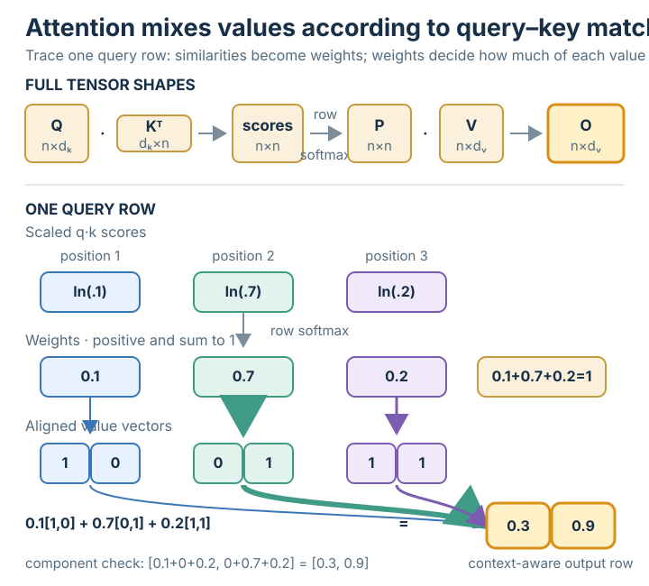

# Transformer attention

## Summary

**Attention** lets each token build a context-aware representation by taking a
weighted average of *value* vectors, where the weights come from how well its
*query* matches each *key*.

## Grounded explanation

Scaled dot-product attention is

$$\mathrm{Attention}(Q,K,V) = \mathrm{softmax}\!\left(\frac{Q K^{\top}}{\sqrt{d_k}}\right) V$$

Read it through the prerequisites:

- Each query–key similarity is a [[vector-dot-product]]; computing all of them at
  once is the [[matrix-multiplication]] $Q K^{\top}$, giving an $n\times n$ score
  matrix.
- Dividing by $\sqrt{d_k}$ keeps the scores from growing with dimension (so
  [[softmax]] gradients stay healthy).
- [[softmax]] turns each row of scores into weights that are positive and sum to 1.
- Multiplying those weights by $V$ (again [[matrix-multiplication]]) takes, for
  each token, the weighted average of all value vectors.

This is the weight matrix LoRA adapts: in practice $W_q, W_k, W_v, W_o$ are the
projections that produce $Q, K, V$ and the output — and lora usually injects
its low-rank update into $W_q$ and $W_v$.

## Prerequisites

- [[softmax]]
- [[vector-dot-product]]
- [[matrix-multiplication]]

## Visual

**1 · Symbols** — 🟦 scalar · 🟩 vector · 🟧 matrix

| Symbol | Type | Shape | Meaning |
|--------|------|-------|---------|
| $Q$ | 🟧 matrix | $n\times d_k$ | queries (one row per token) |
| $K$ | 🟧 matrix | $n\times d_k$ | keys |
| $V$ | 🟧 matrix | $n\times d_v$ | values |
| $Q K^{\top}$ | 🟧 matrix | $n\times n$ | similarity scores (every token vs every token) |
| $O$ | 🟧 matrix | $n\times d_v$ | output (context-mixed values) |
| $d_k$ | 🟦 scalar | — | key/query dimension (sets the $\sqrt{d_k}$ scale) |
| $n$ | 🟦 scalar | — | number of tokens |

**2 · Equation**

$$\mathrm{Attention}(Q,K,V) = \mathrm{softmax}\!\left(\frac{Q K^{\top}}{\sqrt{d_k}}\right) V$$

**3 · Shape**

## Sources

_none_
